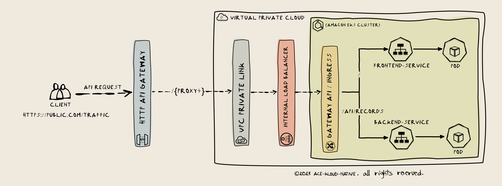
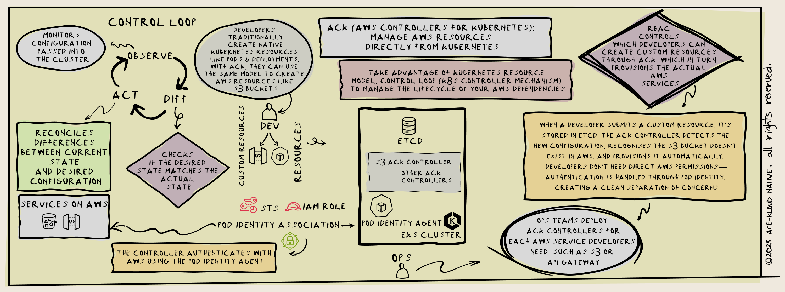

# A Practical Production-Oriented Guide to Integrating Amazon EKS with AWS Services (API Gateway, NLB, etc.)

#### This guide shows how services running on an Amazon EKS cluster are securely exposed to external traffic. External client requests to AWS API Gateway are securely passed through to an internal NLB/ALB via VPC PrivateLink, keeping traffic private to the VPC. At the cluster level, a Gateway API/Ingress Controller receives the traffic and handles routing to various services running on Amazon EKS. You can provision and manage these AWS services using AWS Controllers for Kubernetes (ACK).

> [!NOTE]
> This guide assumes you have basic knowledge of Kubernetes and AWS.

## Summary

- Create an EKS cluster using Auto mode or Standard mode
- Review key considerations for choosing between the two modes
- Deploy relevant add-ons to the cluster, including CoreDNS, Cilium CNI, Pod Identity Agent, and Storage CSI

> [!NOTE]
> These add-ons are deployed automatically as system processes when using Auto mode.

- Install the required ACK (AWS Controllers for Kubernetes) using EKS Capabilities or Helm. This enables AWS services like HTTP API Gateway to be provisioned using Kubernetes-native configurations (CRDs), avoiding the need to context-switch to other IaC tools like OpenTofu or Terraform
- Deploy a sample full-stack app with a UI, worker, and database in a segregated namespace to test the cluster
- Securely expose microservices running in the cluster to external traffic using AWS HTTP API Gateway, VPC PrivateLink, NLB/ALB, and Gateway API/Ingress Controller
- Implement end-to-end encryption at both the application layer (Layer 7) and IP layer (Layer 3)



## Prerequisites Checklist

- [ ] AWS CLI configured with appropriate credentials
- [ ] kubectl v1.33+ installed
- [ ] eksctl v0.195.0+ installed
- [ ] Helm v3.12+ installed
- [ ] jq installed for JSON parsing
- [ ] Decide: Auto Mode vs Standard Mode (see comparison below)

## Decision Matrix: Auto Mode vs Standard Mode

| Factor                 | Auto Mode                     | Standard Mode         |
| ---------------------- | ----------------------------- | --------------------- |
| Management overhead    | Minimal                       | High                  |
| Cost                   | Base + 12%                    | Base only             |
| Customization          | Limited                       | Full control          |
| Upgrade responsibility | AWS                           | You                   |
| Best for               | Teams prioritizing simplicity | Teams needing control |

## Architecture Decision Points

Before proceeding, answer these questions:

1. **CNI Choice**: Using Cilium (Standard) or AWS VPC CNI (Auto)?
2. **Ingress Strategy**: Gateway API or AWS Ingress Controller?
3. **ACK Installation**: Managed Capabilities or Helm?

## What are AWS Controllers for Kubernetes (ACK)?



ACK enables you to manage AWS service dependencies (like S3, RDS, Lambda) directly from Kubernetes using the Kubernetes resource model and control loop. Instead of provisioning AWS resources separately through the console, CLI, or IaC tools, you can define them as Kubernetes custom resources.

**How ACK Works**

ACK leverages the standard Kubernetes control loop:

1. **Observe** - Kubernetes reads your resource configuration
2. **Diff** - Compares desired state with actual state
3. **Act** - Reconciles any differences

While this control loop traditionally manages in-cluster resources (Deployments, Pods, Services), Kubernetes' modular architecture allows ACK to extend this pattern to manage AWS resources outside the cluster.

**Architecture & Workflow**

- ACK releases a separate controller for each AWS service (S3, Lambda, RDS, etc.) - there's no single unified release
- Ops teams deploy controllers for services developers need
- Controllers authenticate with AWS using Pod Identity (or IRSA)
- Developers define custom resources and apply them with `kubectl apply`
- RBAC controls which developers can create specific AWS resources

**Why Use ACK?**

ACK provides a unified workflow for managing both application resources (running in Kubernetes) and infrastructure dependencies (AWS services). Instead of context-switching between Kubernetes manifests and separate IaC tools like Terraform or CloudFormation, developers use a single Kubernetes-native approach for their entire stack. This reduces operational complexity and cognitive overhead, especially for teams already familiar with Kubernetes.

## What's EKS Pod Identity?

EKS Pod Identity enables you to securely connect workloads running in an EKS cluster to AWS services like S3 by linking IAM roles to pods. While similar to IRSA (IAM Roles for Service Accounts), Pod Identity streamlines the operational overhead and is backwards compatible with IRSA.

Key improvements over IRSA:

- No need to create an OIDC provider for each cluster - roles can be reused across multiple clusters without updating trust policies.
- Simplified trust policies using the `pods.eks.amazonaws.com` service principal instead of cluster-specific OIDC endpoints.
- Built-in attribute-based access control (ABAC) through automatic session tags (cluster name, namespace, service account) that enable fine-grained permissions with a single IAM policy.

#### Set essential environmental variables

```bash
export CLUSTER_NAME=basic-cluster
export AWS_REGION=us-east-1
export KUBERNETES_VERSION="1.33"
export APP_NAMESPACE="go-3tier-app"

```

## Create a Kubernetes Cluster using EKS Auto or Standard Mode.

#### Create Kubernetes Cluster with EKSCTL - Standard Mode

- You get to manage and customize the data plane.
- Decisions on compute, stoarge, networking etc are soley your responsibility.
- It gives you room for more flexibility, which also increase the time you need to put in to manage and upgrade your infrastructure.

- Addons: CoreDNS, EBS CSI Driver and eks-pod-identity-agent

#### [EKSCTL Cluster Config File Schema](https://schema.eksctl.io/)

```bash
#Standard Mode
eksctl create cluster -f - <<EOF
apiVersion: eksctl.io/v1alpha5
kind: ClusterConfig

metadata:
  name: ${CLUSTER_NAME} #Cluster name
  region: ${AWS_REGION}
  version: "${KUBERNETES_VERSION}" #Kubernetes version

autoModeConfig:
  # defaults to false; Auto Mode will be enabled by default in an upcoming release of eksctl
  enabled: false

iam:
  withOIDC: false
addonsConfig:
  disableDefaultAddons: true # If true, disables the default EKS addons.

# EKS Pod Identity agent addon, CoreDNS, EBS CSI Driver
addons:
  - name: eks-pod-identity-agent # Installs the EKS Pod Identity agent addon.
    version: latest
  - name: coredns # Installs the CoreDNS addon for DNS-based service discovery.
    version: latest
  - name: aws-ebs-csi-driver # Installs the AWS EBS CSI Driver addon for dynamic EBS volume provisioning.
    version: latest
EOF

kubectl cluster-info
```

## OR

#### [Create EKS Cluster with EKSCTL in Auto Mode](https://docs.aws.amazon.com/eks/latest/userguide/automode.html)

#### [Configure EKS Auto Mode settings](https://docs.aws.amazon.com/eks/latest/userguide/settings-auto.html)

- Auto mode delegates management of both the control plane and data plane to AWS. Nodes scale automatically based on workload demand, and you get automatic cluster upgrades.
- The EKS Pod Identity Agent is pre-installed automatically on Auto mode clusters, but you still need to configure pod identity associations for your workloads.
- Core add-ons (CoreDNS, VPC CNI, and EBS CSI Driver) run as systemd processes on worker nodes rather than as Kubernetes pods. Kube-proxy is also managed automatically by Auto mode.
- Auto mode adds a **12% management fee** calculated on the **on-demand EC2 instance price**:
  - The 12% fee applies to the base EC2 price BEFORE any discounts
  - You still receive your EC2 discounts (Spot: ~70% off, Reserved/Savings Plans: up to 72% off)
  - Example calculation for m5.large:
    - On-demand price: $0.096/hour
    - Auto mode fee: $0.0115/hour (12% of $0.096)
    - With 70% Spot discount: $0.0288 + $0.0115 = $0.0403/hour total
    - Net savings vs on-demand: 58% (not 70%)
  - Verify current pricing on the AWS pricing page as rates and discount percentages may change

```bash
#EKS Auto Mode
# ClusterConfig that creates a cluster with Auto Mode enabled.

eksctl create cluster -f - <<EOF
apiVersion: eksctl.io/v1alpha5
kind: ClusterConfig

metadata:
  name: ${CLUSTER_NAME}
  region: ${AWS_REGION}

autoModeConfig:
  # defaults to false
  enabled: true
  # optional, defaults to [general-purpose, system].
  # To disable creation of nodePools, set it to the empty array ([]).
  nodePools: [general-purpose, system]
  # optional, eksctl creates a new role if this is not supplied
  # and nodePools are present.
#  nodeRoleARN: ""
addonsConfig:
  autoApplyPodIdentityAssociations: true

vpc:
  nat:
    gateway: Single  # or HighlyAvailable for production
  clusterEndpoints:
    privateAccess: true
    publicAccess: true  # Can set to false for fully private

iam:
  podIdentityAssociations:
    # EBS CSI Driver - ADD THIS ONE
    - namespace: kube-system
      serviceAccountName: ebs-csi-controller-sa
      createServiceAccount: true
      roleName: eks-ebs-csi-driver-role
      permissionPolicyARNs:
        - arn:aws:iam::aws:policy/service-role/AmazonEBSCSIDriverPolicy

    - namespace: kube-system
      serviceAccountName: ack-apigatewayv2-controller
      createServiceAccount: true
      roleName: EKS-API-Gateway-Controller-Role
      permissionPolicy:
        Version: "2012-10-17"
        Statement:
        - Effect: Allow
          Action:
          - "apigateway:*"
          Resource: 'arn:aws:apigateway:*::/*'
        - Effect: Allow
          Action:
          - "iam:CreateServiceLinkedRole"
          Resource: "*"

    - namespace: kube-system
      serviceAccountName: aws-load-balancer-controller
      createServiceAccount: true
      roleName: EKS-LoadBalancer-Controller-Role
      wellKnownPolicies:
        awsLoadBalancerController: true

    - namespace: kube-system
      serviceAccountName: ack-ec2-controller
      createServiceAccount: false
      roleName: EKS-EC2-Controller-Role
      permissionPolicy:
        Version: "2012-10-17"
        Statement:
        - Effect: Allow
          Action:
          - "ec2:*"
          Resource: '*'
        - Effect: Allow
          Action:
          - "iam:CreateServiceLinkedRole"
          Resource: "*"
EOF

kubectl cluster-info
```

#### EKS Capabilities (Managed)

> [!IMPORTANT]
>
> [Enable EKS managed capabilities instead of using Helm to install ACK controllers](https://aws-controllers-k8s.github.io/docs/getting-started-eks)
>
> ACK is available as a fully managed EKS capability. AWS handles controller installation, updates, and scaling—no Helm or manual installation required.
> Examples using Helm as an alternative installation method are provided below for reference.

```bash

# Create ACK Capability Using eksctl
eksctl create capability \
  --cluster ${CLUSTER_NAME} \
  --region ${AWS_REGION} \
  --name ack \
  --type ACK \
  --role-arn arn:aws:iam::$(aws sts get-caller-identity --query Account --output text):role/ACKCapabilityRole

# Verify Capability is Active
eksctl get capability --cluster ${CLUSTER_NAME} --region ${AWS_REGION} --name ack -o yaml

# Get the Capability Role Name
export capabilityRoleArn=$(eksctl get capability --cluster ${CLUSTER_NAME} --region ${AWS_REGION} --name ack -o yaml | grep roleArn | sed 's/.*roleArn: //')
export CAPABILITY_ROLE_NAME="${capabilityRoleArn##*/}"

echo "CAPABILITY ROLE ARN: $capabilityRoleArn"

echo "CAPABILITY ROLE NAME: $CAPABILITY_ROLE_NAME"

# Attach the AdministratorAccess managed policy to the role (Use more granular policies in production):
aws iam attach-role-policy --role-name $CAPABILITY_ROLE_NAME --policy-arn arn:aws:iam::aws:policy/AdministratorAccess

# Verify CRDs are available
kubectl api-resources | grep services.k8s.aws
```

## Get required cluster info

```bash
# Unique Private Subnets in each AZ
export SUBNET_JSON=$(aws eks describe-cluster \
  --name ${CLUSTER_NAME} \
  --region ${AWS_REGION} \
  --query 'cluster.resourcesVpcConfig.vpcId' \
  --output text | \
  xargs -I {} aws ec2 describe-subnets \
    --filters "Name=vpc-id,Values={}" \
              "Name=map-public-ip-on-launch,Values=false" \
    --query 'Subnets[*].{SubnetId:SubnetId,AZ:AvailabilityZone}' \
    --output json | \
  jq '[group_by(.AZ) | .[] | .[0].SubnetId]')

echo "Private subnets (one per AZ): ${SUBNET_JSON}"


# Get cluster security group
export CLUSTER_SG=$(aws eks describe-cluster --name ${CLUSTER_NAME} --region ${AWS_REGION} \
  --query 'cluster.resourcesVpcConfig.clusterSecurityGroupId' --output text)

echo "Cluster Security Group ID: ${CLUSTER_SG}"

# Get VPC ID and VPC CIDR (CRITICAL: Must be done before Cilium install)
export VPC_ID=$(aws eks describe-cluster --name ${CLUSTER_NAME} --region ${AWS_REGION} --query "cluster.resourcesVpcConfig.vpcId" --output text)
export VPC_CIDR=$(aws ec2 describe-vpcs --vpc-ids ${VPC_ID} --region ${AWS_REGION} --query 'Vpcs[0].CidrBlock' --output text)

echo "VPC_ID: ${VPC_ID}"
echo "VPC_CIDR: ${VPC_CIDR}"

```

#### Create pod identity associations to grant AWS permissions to workloads, controllers, and service accounts

Grant the necessary AWS permissions to the following components:

- Cilium operator service account
- AWS Load Balancer Controller
- EBS CSI controller
- ACK API Gateway v2 controller

> [!IMPORTANT]
> Only while using standard mode.

[Amazon EKS Pod Identity](https://aws.amazon.com/blogs/containers/amazon-eks-pod-identity-a-new-way-for-applications-on-eks-to-obtain-iam-credentials/)

```bash
eksctl create podidentityassociation -f - <<EOF
apiVersion: eksctl.io/v1alpha5
kind: ClusterConfig

metadata:
  name: ${CLUSTER_NAME} #Cluster name
  region: ${AWS_REGION}
  version: "${KUBERNETES_VERSION}"

# Creating Pod Identity Associations to grant permissions to AWS Load Balancer controller & API Gateway controller.
iam:
  # roleARN is not given, eksctl will first create an IAM role with automatically generated roleName,
  podIdentityAssociations:
  # EBS CSI Driver - ADD THIS ONE
  - namespace: kube-system
    serviceAccountName: ebs-csi-controller-sa
    createServiceAccount: true
    roleName: eks-ebs-csi-driver-role
    permissionPolicyARNs:
      - arn:aws:iam::aws:policy/service-role/AmazonEBSCSIDriverPolicy
  - namespace: kube-system
    serviceAccountName: cilium-operator
    createServiceAccount: false  # Automatically create the service account if not existing
    roleName: eks-cilium-controller-role
    permissionPolicy:
      Version: "2012-10-17"
      Statement:
      - Effect: Allow
        Action:
        - "ec2:CreateNetworkInterface"
        - "ec2:AttachNetworkInterface"
        - "ec2:DeleteNetworkInterface"
        - "ec2:DetachNetworkInterface"
        - "ec2:DescribeNetworkInterfaces"
        - "ec2:ModifyNetworkInterfaceAttribute"
        - "ec2:AssignPrivateIpAddresses"
        - "ec2:UnassignPrivateIpAddresses"
        - "ec2:DescribeInstanceTypes" # Required for ENI mode
        - "ec2:DescribeInstances"
        - "ec2:DescribeSubnets"
        - "ec2:DescribeVpcs"
        - "ec2:CreateTags"
        - "ec2:DescribeSecurityGroups"
        - "ec2:DescribeRouteTables"
        - "ec2:DescribeAvailabilityZones"
        Resource: '*'

  - namespace: kube-system
    serviceAccountName: aws-load-balancer-controller
    createServiceAccount: true
    roleName: EKS-LoadBalancer-Controller-Role
    wellKnownPolicies:
      awsLoadBalancerController: true
    # permissionPolicy:
    #   Version: "2012-10-17"
    #   Statement:
    #   - Effect: Allow
    #     Action:
    #     - "ec2:*"
    #     Resource: '*'
    #   - Effect: Allow
    #     Action:
    #     - "elasticloadbalancing:*"
    #     Resource: '*'

  - namespace: kube-system
    serviceAccountName: ack-apigatewayv2-controller
    createServiceAccount: true
    roleName: EKS-API-Gateway-Controller-Role
    permissionPolicy:
      Version: "2012-10-17"
      Statement:
      - Effect: Allow
        Action:
        - "apigateway:*"
        Resource: 'arn:aws:apigateway:*::/*'
      - Effect: Allow
        Action:
        - "iam:CreateServiceLinkedRole"
        Resource: "*"

  - namespace: kube-system
    serviceAccountName: ack-ec2-controller
    createServiceAccount: false
    roleName: EKS-EC2-Controller-Role
    permissionPolicy:
      Version: "2012-10-17"
      Statement:
      - Effect: Allow
        Action:
        - "ec2:*"
        Resource: '*'
      - Effect: Allow
        Action:
        - "iam:CreateServiceLinkedRole"
        Resource: "*"

EOF
```

## Install Cilium CNI on the cluster using helm and replace Kube-proxy, enable Gateway API for service communication, enable WireGuard for Pod to Pod communication encryption. (Standard mode only)

> [!NOTE]
> This step is not required when using Auto mode. Auto mode uses VPC CNI by default and manages networking automatically.

[Helm install Cilium docs](https://docs.cilium.io/en/stable/installation/k8s-install-helm/)

#### You can install Cilium in either ENI mode or Overlay mode on an EKS cluster.

- In case of ENI mode, Cilium will manage ENIs instead of the VPC CNI.
- Set your API_SERVER_IP and API_SERVER_PORT by using `kubectl cluster-info`

#### Before we install Cilium with Gateway API, we need to make sure we install the Gateway API CRDs

[Install standard channels crds](https://gateway-api.sigs.k8s.io/guides/?h=crds#getting-started-with-gateway-api)

```bash
# Install Cilium Gateway API CRDs
kubectl apply -f https://github.com/kubernetes-sigs/gateway-api/releases/download/v1.4.0/standard-install.yaml


# Install Cilium using Helm
helm repo add cilium https://helm.cilium.io/ && helm repo update cilium

API_SERVER_IP=$(aws eks describe-cluster --name $CLUSTER_NAME --query "cluster.endpoint" --output text | sed 's|https://||')
API_SERVER_PORT=443


helm install cilium cilium/cilium --version 1.18.4 \
  --namespace kube-system \
  --set eni.enabled=true \
  --set ipam.mode=eni \
  --set egressMasqueradeInterfaces=eth0 \
  --set enableIPv4Masquerade=true \
  --set ipv4NativeRoutingCIDR=${VPC_CIDR} \
  --set operator.serviceAccount.name=cilium-operator \
  --set operator.serviceAccount.create=false \
  --set routingMode=native \
  --set kubeProxyReplacement=true \
  --set nodePort.enabled=true \
  --set l7Proxy=true \
  --set endpointRoutes.enabled=true \
  --set k8sServiceHost=${API_SERVER_IP} \
  --set k8sServicePort=${API_SERVER_PORT} \
  --set cluster.name=${CLUSTER_NAME} \
  --set encryption.enabled=true \
  --set encryption.type=wireguard \
  --set gatewayAPI.enabled=true\
  --set operator.replicas=1

cilium status
# IMPORTANT: enableIPv4Masquerade=true + ipv4NativeRoutingCIDR hybrid approach:
# - enableIPv4Masquerade=true: Required for internet/AWS public endpoint access via NAT Gateway
#   Without this, pods cannot reach internet because NAT Gateway won't translate pod IPs
# - ipv4NativeRoutingCIDR="${VPC_CIDR}": Preserves pod source IPs for VPC-internal traffic
#   This means traffic to VPC endpoints and internal services keeps original pod IPs
#   Benefits: Better traceability in AWS logs, no conntrack pressure for VPC traffic
```

## Deploy Managed NodeGroups where the workloads can run.

> [!IMPORTANT]
> Only while using standard mode.

- AMI is BottleRocket
- Taint the Nodes (application pods are not scheduled/executed until Cilium is deployed)

```bash
# Get private subnet IDs (SECURITY BEST PRACTICE: Nodes should be in private subnets)
PRIVATE_SUBNETS=$(aws ec2 describe-subnets \
  --filters "Name=vpc-id,Values=${VPC_ID}" "Name=map-public-ip-on-launch,Values=false" \
  --query 'Subnets[*].SubnetId' --output json)

echo "Private subnets: ${PRIVATE_SUBNETS}"

eksctl create nodegroup -f - <<EOF
apiVersion: eksctl.io/v1alpha5
kind: ClusterConfig

metadata:
  name: ${CLUSTER_NAME} #Cluster name
  region: ${AWS_REGION}
  version: "${KUBERNETES_VERSION}"  #Kubernetes version

managedNodeGroups:
  - name: managed-ng-1
    minSize: 1
    maxSize: 2
    desiredCapacity: 1
    amiFamily: "Bottlerocket"
    instanceType: m5.large
    volumeSize: 20
    privateNetworking: true  # CRITICAL: Forces nodes into private subnets, no public IPs
    subnets: ${PRIVATE_SUBNETS}
    labels: {role: worker}
    tags:
      costid: iac
      createdby: eksctl
      nodegroup-role: worker
    taints:   # application pods are not scheduled/executed until Cilium is deployed.
    - key: "node.cilium.io/agent-not-ready"
      value: "true"
      effect: "NoExecute"
EOF

kubectl get nodes
cilium status

# SECURITY NOTE: privateNetworking: true ensures:
# - Nodes get NO public IPs
# - Nodes only accessible from within VPC
# - Internet access via NAT Gateway (controlled egress)
# - Reduced attack surface and compliance-ready
# - If omitted, eksctl defaults to PUBLIC subnets (NOT SECURE!)
```

#### Create a namespace to isolate the application and it's dependencies

```bash
kubectl apply -f - <<EOF
apiVersion: v1
kind: Namespace
metadata:
  name: ${APP_NAMESPACE}
spec: {}
status: {}
EOF

kubectl get namespaces
```

## Deploy relevant AWS Controllers for Kubernetes (ACK) in the EKS cluster and grant them required permissions using Helm

> [!IMPORTANT]
> This is an alternative to using EKS capabilities (managed). EKS capabilities are the recommended approach for production environments.

# List of ACK Controllers to be installed

- EC2
- API Gateway
- ALB

## Deploy ACK Controller for EC2 using Helm

> [!IMPORTANT]
> Only required when not using EKS managed capabilities.

The ACK Controller for EC2 is needed to provision VPC interface endpoints for:

- **EC2 endpoint**: Required by EBS CSI driver to privately reach the AWS EC2 service endpoint (`https://ec2.${AWS_REGION}.amazonaws.com`). NAT Gateway is an alternative.
- **STS endpoint**: Required by EBS CSI driver, which uses Pod Identity for authentication
- **Other AWS service endpoints**: The EC2 controller can provision VPC endpoints for any AWS service

### How VPC Interface Endpoints Work

- VPC endpoints create ENIs (Elastic Network Interfaces) in your subnets
- Traffic flows through those ENIs to reach the AWS service
- The security group must allow inbound traffic on port 443 from your VPC CIDR to those ENIs
- Without the security group rule, pods cannot reach the VPC endpoint

### Cost Considerations for Interface Endpoints

**Per endpoint pricing:**

- ~$7.20/month per endpoint per AZ
- Plus $0.01/GB data processed

**Example: 2 endpoints across 2 AZs (2 subnets):**

- 2 endpoints × 2 AZs × $7.20 = ~$28.80/month (plus data transfer costs)

### Reference

https://aws-controllers-k8s.github.io/community/docs/tutorials/ec2-example/

```bash
export EC2_SERVICE=ec2
export RELEASE_VERSION=$(curl -sL https://api.github.com/repos/aws-controllers-k8s/${EC2_SERVICE}-controller/releases/latest | jq -r '.tag_name | ltrimstr("v")')
export ACK_SYSTEM_NAMESPACE=kube-system

aws ecr-public get-login-password --region $AWS_REGION | helm registry login --username AWS --password-stdin public.ecr.aws

helm install  -n $ACK_SYSTEM_NAMESPACE --create-namespace ack-$EC2_SERVICE-controller \
--set serviceAccount.create=true --set serviceAccount.name=ack-$EC2_SERVICE-controller \
  oci://public.ecr.aws/aws-controllers-k8s/$EC2_SERVICE-chart --version=$RELEASE_VERSION --set=aws.region=$AWS_REGION

#Check the CRDs have been installed using:
kubectl get crds | grep -i ec2
```

## **_Create Security group for endpoints_**

```bash
kubectl apply -f - <<EOF
apiVersion: ec2.services.k8s.aws/v1alpha1
kind: SecurityGroup
metadata:
  name: endpoints-sg
  namespace: ${APP_NAMESPACE}
spec:
  description: "Endpoints security group"
  name: SG_ENDPOINTS
  vpcID: ${VPC_ID}
  ingressRules:
    - ipProtocol: tcp
      fromPort: 443
      toPort: 443
      userIDGroupPairs:
      - groupID: ${CLUSTER_SG}  # Reference the node group SGs
        description: "Allow HTTPS inbound"
  egressRules:
    - ipProtocol: tcp
      fromPort: 443
      toPort: 443
      ipRanges:
        - cidrIP: 0.0.0.0/0
          description: "Allow HTTPS outbound"
EOF

kubectl wait \
  --for=condition=Ready \
  securitygroup/endpoints-sg \
  -n "$APP_NAMESPACE" \
  --timeout=2m

kubectl describe securitygroup -n $APP_NAMESPACE

```

## Each VPC endpoint is tied to a specific AWS service, so traffic stays private

## Create VPC endpoints so the controller (e.g, CSI-EBS controller) can reach AWS Service endpoints:

```bash

kubectl apply -f - <<EOF
apiVersion: ec2.services.k8s.aws/v1alpha1
kind: VPCEndpoint
metadata:
  name: ec2-api-endpoint
  namespace: ${APP_NAMESPACE}
spec:
  vpcID: ${VPC_ID}
  serviceName: com.amazonaws.${AWS_REGION}.ec2
  vpcEndpointType: Interface
  subnetIDs: ${SUBNET_JSON}
  securityGroupRefs:
    - from:
        name: endpoints-sg  # Reference the API Gateway Endpoint SG
        namespace: ${APP_NAMESPACE}
  privateDNSEnabled: true
  tags:
    - key: Name
      value: eks-ec2-api-endpoint
    - key: ManagedBy
      value: ACK
    - key: Purpose
      value: EBS-CSI-Driver
EOF

kubectl wait \
  --for=condition=Ready \
  vpcendpoint/ec2-api-endpoint \
  -n "$APP_NAMESPACE" \
  --timeout=4m

# Check the resource status
kubectl describe vpcendpoint ec2-api-endpoint -n $APP_NAMESPACE

# Verify in AWS
aws ec2 describe-vpc-endpoints \
  --filters "Name=vpc-id,Values=${VPC_ID}" "Name=service-name,Values=com.amazonaws.us-east-1.ec2" \
  --query 'VpcEndpoints[].[VpcEndpointId,State,ServiceName]' \
  --output table
```

## Create VPC endpoint for STS

```bash
kubectl apply -f - <<EOF
apiVersion: ec2.services.k8s.aws/v1alpha1
kind: VPCEndpoint
metadata:
  name: sts-endpoint
  namespace: ${APP_NAMESPACE}
spec:
  vpcID: ${VPC_ID}
  serviceName: com.amazonaws.${AWS_REGION}.sts
  vpcEndpointType: Interface
  subnetIDs: ${SUBNET_JSON}
  securityGroupRefs:
    - from:
        name: endpoints-sg
        namespace: ${APP_NAMESPACE}
  privateDNSEnabled: true
  tags:
    - key: Name
      value: eks-sts-endpoint
    - key: ManagedBy
      value: ACK
    - key: Purpose
      value: Pod-Identity
EOF

kubectl wait \
  --for=condition=Ready \
  vpcendpoints.ec2.services.k8s.aws/sts-endpoint \
  -n "$APP_NAMESPACE" \
  --timeout=4m

kubectl get vpcendpoints.ec2.services.k8s.aws -n $APP_NAMESPACE

kubectl describe vpcendpoints.ec2.services.k8s.aws -n $APP_NAMESPACE sts-endpoint
```

## Deploy the ACK Controller for AWS Load Balancer using Helm.

> [!IMPORTANT]
>
> [Only when not using EKS Managed Capabilities]

#### Cilium Gateway API / AWS Ingress Controller will need it to create NLBs/ALBs

[Deploy ALB Controller with Helm](https://docs.aws.amazon.com/eks/latest/userguide/lbc-helm.html)

```bash

helm repo add eks https://aws.github.io/eks-charts && helm repo update eks

helm install aws-load-balancer-controller eks/aws-load-balancer-controller \
-n kube-system \
--set clusterName=$CLUSTER_NAME \
--set serviceAccount.create=false \
--set serviceAccount.name=aws-load-balancer-controller \
--set region=$AWS_REGION \
--set vpcId=$VPC_ID

kubectl get deployment -n kube-system aws-load-balancer-controller
```

## The AWS Load Balancer Controller needs to privately reach the AWS ELB Service endpoint. You need a VPC endpoint for Elastic Load Balancers.

```bash

kubectl apply -f - <<EOF
apiVersion: ec2.services.k8s.aws/v1alpha1
kind: VPCEndpoint
metadata:
  name: elasticloadbalancing-endpoint
  namespace: ${APP_NAMESPACE}
spec:
  vpcID: ${VPC_ID}
  serviceName: com.amazonaws.${AWS_REGION}.elasticloadbalancing
  vpcEndpointType: Interface
  subnetIDs: ${SUBNET_JSON}
  securityGroupRefs:
    - from:
        name: endpoints-sg  # Reference the Endpoint SG
        namespace: ${APP_NAMESPACE}
  privateDNSEnabled: true
  tags:
    - key: Name
      value: elasticloadbalancing-vpc-endpoint
EOF

kubectl wait \
  --for=condition=Ready \
  vpcendpoint/elasticloadbalancing-endpoint \
  -n "$APP_NAMESPACE" \
  --timeout=4m

# Check the resource status
kubectl describe vpcendpoint ec2-api-endpoint -n $APP_NAMESPACE

# Verify on AWS
aws ec2 describe-vpc-endpoints \
  --filters "Name=vpc-id,Values=${VPC_ID}" "Name=service-name,Values=com.amazonaws.${AWS_REGION}.elasticloadbalancing" \
  --query 'VpcEndpoints[*].[VpcEndpointId,State]' \
  --output table
```

## Run workloads on the cluster you created.

#### Create a Storage Class to persist MongoDB data

```bash
# Get CSIDriver name, this should match the storageclass provisioner for ebs
kubectl get csidriver -o jsonpath='{range .items[*]}{.metadata.name}{"\n"}{end}'

export provisioner=$(kubectl get csidriver -o jsonpath='{range .items[*]}{.metadata.name}{"\n"}{end}' | grep '^ebs')
echo "EBS StorageClass Provisioner: $provisioner"

# Check for the default storage class
kubectl get storageclass


# StorageClass when using Standard Mode
kubectl apply -f - <<EOF
kind: StorageClass
apiVersion: storage.k8s.io/v1
metadata:
 name: auto-ebs-sc
 annotations:
   storageclass.kubernetes.io/is-default-class: "true"
provisioner: ${provisioner}  # EKS Standard mode addon (v1.37+) use ebs.csi.aws.com (Auto mode addon uses ebs.csi.eks.amazonaws.com)
parameters:
 type: gp3                 # Specifies the volume type (gp3)
 fsType: ext4              # Filesystem type
 iops: "3000"              # Configurable IOPS (min: 3000, max: 16000)
 throughput: "125"         # Throughput in MiB/s (max: 1000 for gp3)
volumeBindingMode: WaitForFirstConsumer
reclaimPolicy: Delete
allowVolumeExpansion: true
EOF


# Check for the new storage class
kubectl get storageclass

```

#### Create a PersistentVolumeClaim

```bash
kubectl apply -f - <<EOF
kind: PersistentVolumeClaim
apiVersion: v1
metadata:
  name: mongo-pvc
  namespace: ${APP_NAMESPACE}
spec:
  accessModes:
    - ReadWriteOnce
  storageClassName: auto-ebs-sc
  resources:
    requests:
      storage: 1Gi
EOF

kubectl get pvc -n $APP_NAMESPACE
```

#### Deploy app using Helm (Deployment, Service, ConfigMap)

```bash
# Add helm repo for the app
helm repo add go-app-chart https://fiduh.github.io/k8s/eksctl/charts && helm repo update go-app-chart

helm search repo go-app-chart


helm install goapp go-app-chart/go-app-chart -n $APP_NAMESPACE

kubectl get pods,svc -n $APP_NAMESPACE
```

## Directing external user (Client) traffic to the application running in the cluster.

#### Gateway API (Cilium implementation) (North/South Traffic) - Routes traffic into the cluster. It creates a LoadBalancer Service that provisions an internal NLB to accept traffic from API Gateway via VPC link.

> [!IMPORTANT]
> Only applicable when using Standard mode with Cilium CNI.

**Gateway API Components:**

- **GatewayClass**: Deployed automatically when Cilium is installed with `gatewayAPI.enabled=true`
- **Gateway**: Defines the load balancer configuration
- **HTTPRoute**: Routes traffic from the Gateway to backend services

**Traffic Flow:**

```
External Client → AWS API Gateway → VPC Link → Internal NLB → Gateway → HTTPRoute → Service → Pods
```

```bash

# Gateway Config
kubectl apply -f - <<EOF
apiVersion: gateway.networking.k8s.io/v1
kind: Gateway
metadata:
  name: cluster-gateway
  namespace: ${APP_NAMESPACE}
spec:
  gatewayClassName: cilium
  listeners:
  - protocol: HTTP
    port: 80
    name: web-gw
    allowedRoutes:
      namespaces:
        from: All
EOF


# HTTProute config
kubectl apply -f - <<EOF
apiVersion: gateway.networking.k8s.io/v1beta1
kind: HTTPRoute
metadata:
  name: combined-route
  namespace: ${APP_NAMESPACE}
spec:
  parentRefs:
    - name: cluster-gateway
  rules:
    - matches:
        - path:
            type: PathPrefix
            value: "/api/"
      backendRefs:
        - name: backend-service
          port: 8080
    - matches:
        - path:
            type: PathPrefix
            value: "/"
      backendRefs:
        - name: frontend-service
          port: 8080
EOF

kubectl get httproute -n $APP_NAMESPACE
kubectl get gateway -n $APP_NAMESPACE

kubectl describe httproute -n $APP_NAMESPACE combined-route
kubectl describe gateway -n $APP_NAMESPACE cluster-gateway
kubectl get svc -n go-3tier-app -l "gateway.networking.k8s.io/gateway-name=cluster-gateway"

```

## OR

#### [Create an AWS IngressClass to configure an Application Load Balancer](https://docs.aws.amazon.com/eks/latest/userguide/auto-configure-alb.html)

#### Recommended when using auto mode, because the AWS VPC CNI is baked in as a system process.

> [!IMPORTANT]
> Only when using Auto mode

```bash

# Ingress Class
kubectl apply -f - <<EOF
apiVersion: networking.k8s.io/v1
kind: IngressClass
metadata:
  name: alb
  annotations:
    # Use this annotation to set an IngressClass as Default
    # If an Ingress doesn't specify a class, it will use the Default
    ingressclass.kubernetes.io/is-default-class: "true"
spec:
  # Configures the IngressClass to use EKS Auto Mode
  controller: eks.amazonaws.com/alb
  parameters:
    apiGroup: eks.amazonaws.com
    kind: IngressClassParams
    # Use the name of the IngressClassParams set in the previous step
    name: alb
EOF

# Ingress Class Parameters

kubectl apply -f - <<EOF
apiVersion: eks.amazonaws.com/v1
kind: IngressClassParams
metadata:
  name: alb
spec:
  scheme: internal
EOF

# Ingress Routing Rules (Resource)

kubectl apply -f - <<EOF
apiVersion: networking.k8s.io/v1
kind: Ingress
metadata:
  name: minimal-ingress
  namespace: ${APP_NAMESPACE}
  annotations:
    nginx.ingress.kubernetes.io/rewrite-target: /
    # Use AWS ALB
    ingressClassName: alb
spec:
  rules:
    - http:
        paths:
          - path: /api/record
            pathType: Prefix
            backend:
              service:
                name: backend-service
                port:
                  number: 8080
    - http:
        paths:
          - path: /
            pathType: Prefix
            backend:
              service:
                name: frontend-service
                port:
                  number: 8080
EOF


## Check Status
kubectl get ingress -n $APP_NAMESPACE
```

## Create AWS API Gateway resources

#### Deploy ACK Controller for API Gateway

> [!IMPORTANT]
>
> [Only when not using EKS Managed Capabilities]

[Installing AWS Service Controllers](https://aws-controllers-k8s.github.io/community/docs/user-docs/install/)

**_Helm charts for ACK service controllers can be found in the_** [ACK registry within the Amazon ECR Public Gallery](https://gallery.ecr.aws/aws-controllers-k8s). To find a Helm chart for a specific service, you can go to gallery.ecr.aws/aws-controllers-k8s/$SERVICENAME-chart. For example, the link to the ACK service controller Helm chart for Amazon Simple Storage Service (Amazon S3) is gallery.ecr.aws/aws-controllers-k8s/s3-chart.

_You can use the Helm CLI to log into the ECR public Helm registry and install the chart._

```bash
export ACK_SYSTEM_NAMESPACE=kube-system
export API_GATEWAY_SERVICE=apigatewayv2
export RELEASE_VERSION=$(curl -sL https://api.github.com/repos/aws-controllers-k8s/${API_GATEWAY_SERVICE}-controller/releases/latest | jq -r '.tag_name | ltrimstr("v")')
export CHART_REPO=oci://public.ecr.aws/aws-controllers-k8s

aws ecr-public get-login-password --region us-east-1 | helm registry login --username AWS --password-stdin public.ecr.aws


helm install --create-namespace -n $ACK_SYSTEM_NAMESPACE ack-$API_GATEWAY_SERVICE-controller \
$CHART_REPO/$API_GATEWAY_SERVICE-chart --version $RELEASE_VERSION --set=aws.region=$AWS_REGION \
--set serviceAccount.name=ack-apigatewayv2-controller --set=serviceAccount.create=false

kubectl get pods -n kube-system -l app.kubernetes.io/instance=ack-apigatewayv2-controller
```

## There are Two Different API Gateway Services:

| Service Name                          | Purpose                     | Used By                  |
| ------------------------------------- | --------------------------- | ------------------------ |
| `com.amazonaws.us-east-1.execute-api` | Invoke APIs (data plane)    | Your application clients |
| `com.amazonaws.us-east-1.apigateway`  | Manage APIs (control plane) | ACK controller           |

#### VPC endpoint for execute-api (API Gateway data plane for invoking APIs), and the ACK controller needs to connect to the apigateway service (API Gateway control plane for managing APIs).

```bash

kubectl apply -f - <<EOF
apiVersion: ec2.services.k8s.aws/v1alpha1
kind: VPCEndpoint
metadata:
  name: apigateway-endpoint
  namespace: ${APP_NAMESPACE}
spec:
  vpcID: ${VPC_ID}
  serviceName: com.amazonaws.us-east-1.execute-api
  vpcEndpointType: Interface
  subnetIDs: ${SUBNET_JSON}
  # securityGroupIDs:
  # - string
  securityGroupRefs:
    - from:
        name: endpoints-sg  # Reference the Endpoint SG
        namespace: ${APP_NAMESPACE}
  privateDNSEnabled: true
  tags:
    - key: Name
      value: apigateway-vpc-endpoint
    - key: ManagedBy
      value: ACK
EOF

kubectl wait \
  --for=condition=Ready \
  vpcendpoint/apigateway-endpoint \
  -n "$APP_NAMESPACE" \
  --timeout=2m

kubectl get vpcendpoint -n $APP_NAMESPACE
kubectl describe vpcendpoint apigateway-endpoint -n $APP_NAMESPACE
```

#### Create VPC Endpoint for API Gateway Management Service (com.amazonaws.${AWS_REGION}.apigateway) - Your controller creates/manages API Gateway resources, so it needs the apigateway endpoint, not execute-api.

> [!NOTE]
> API Gateway service is only available in specific AZs in some Regions, e.g. (us-east-1b, us-east-1c, us-east-1d) in US-EAST-1 Region

#### We need to find a compatible subnet in one of these zones

```bash
# Get API Gateway service AZs for a specific region
SERVICE_NAME="com.amazonaws.${AWS_REGION}.apigateway"

APIGW_AZS=$(aws ec2 describe-vpc-endpoint-services \
  --region ${AWS_REGION} \
  --filters "Name=service-name,Values=${SERVICE_NAME}" \
  --query 'ServiceDetails[0].AvailabilityZones' \
  --output json)

echo "API Gateway available in: ${APIGW_AZS}"

# Get private subnets and filter to only those in service AZs
COMPATIBLE_SUBNETS=$(aws ec2 describe-subnets \
  --region "${AWS_REGION}" \
  --filters "Name=vpc-id,Values=${VPC_ID}" "Name=map-public-ip-on-launch,Values=false" \
  --query 'Subnets[*]' --output json | \
  jq -r --argjson azs "${APIGW_AZS}" '[.[] | select(.AvailabilityZone as $az | $azs | index($az)) | .SubnetId] | map("    - " + .) | join("\n")')

echo "Compatible subnet: ${COMPATIBLE_SUBNETS}"


kubectl apply -f - <<EOF
apiVersion: ec2.services.k8s.aws/v1alpha1
kind: VPCEndpoint
metadata:
  name: apigateway-management-endpoint
  namespace: ${APP_NAMESPACE}
spec:
  vpcID: ${VPC_ID}
  serviceName: com.amazonaws.${AWS_REGION}.apigateway
  vpcEndpointType: Interface
  subnetIDs:
${COMPATIBLE_SUBNETS}
  securityGroupRefs:
    - from:
        name: endpoints-sg  # Reference the Endpoint SG
        namespace: ${APP_NAMESPACE}
  privateDNSEnabled: true
  tags:
    - key: Name
      value: apigateway-management-endpoint
    - key: ManagedBy
      value: ACK
    - key: Purpose
      value: ACK-APIGateway-Controller
EOF


kubectl wait \
  --for=condition=Ready \
  vpcendpoint/apigateway-management-endpoint \
  -n "$APP_NAMESPACE" \
  --timeout=2m

kubectl get vpcendpoint -n $APP_NAMESPACE
kubectl describe vpcendpoint apigateway-management-endpoint -n $APP_NAMESPACE


aws ec2 describe-vpc-endpoints \
 --filters "Name=vpc-id,Values=${VPC_ID}" \
 --query 'VpcEndpoints[].[ServiceName,State,VpcEndpointId]' \
 --output table
```

#### Create security group for the VPC link:

- In production VPC Link Security group should only allow inbound / outbound traffic on port 443. this ensures encryption of traffic from the VPC Link to the Internal Load balancer, then to the pods.

> [!WARNING] > **Security Issues with Unencrypted Internal Traffic (Port 80):**
>
> - Data is transmitted in plaintext within your VPC
> - Fails to meet compliance standards (PCI-DSS, HIPAA require encryption in transit)
> - Vulnerable to insider threats—anyone with VPC access can intercept traffic

### Recommended Approach: TLS Passthrough (End-to-End Encryption)

**TLS passthrough provides true end-to-end encryption** by keeping traffic encrypted from the client all the way to your pods:

- Configure the NLB to forward encrypted traffic on port 443 without terminating TLS
- VPC Link security group allows port 443 traffic
- Pods handle TLS termination with their own certificates
- Use **cert-manager** or **Cilium Gateway** for automatic certificate management

**Pros:** True end-to-end encryption  
**Cons:** More complex certificate management at the pod level

#### https://aws-controllers-k8s.github.io/community/reference/ec2/v1alpha1/securitygroup/

```bash

kubectl apply -f - <<EOF
apiVersion: ec2.services.k8s.aws/v1alpha1
kind: SecurityGroup
metadata:
  name: sg-vpc-link
  namespace: ${APP_NAMESPACE}
spec:
  description: "ack security group"
  name: SG_VPC_LINK
  vpcID: ${VPC_ID}
  ingressRules:
    - ipProtocol: tcp
      fromPort: 443
      toPort: 443
      userIDGroupPairs:
      - groupID: ${CLUSTER_SG}  # Reference your node group SGs
        description: "Allow HTTPS inbound"
  egressRules:
    - ipProtocol: tcp
      fromPort: 443
      toPort: 443
      ipRanges:
        - cidrIP: 0.0.0.0/0
          description: "Allow HTTPS outbound"
    - ipProtocol: tcp
      fromPort: 80
      toPort: 80
      ipRanges:
        - cidrIP: 0.0.0.0/0
          description: "Allow HTTP to NLB"
EOF


kubectl wait \
  --for=condition=Ready \
  securitygroup/sg-vpc-link \
  -n "$APP_NAMESPACE" \
  --timeout=50s

kubectl get securitygroup -n $APP_NAMESPACE -owide
kubectl describe securitygroup sg-vpc-link -n $APP_NAMESPACE

export VPCLINK_SG=$(aws ec2 describe-security-groups \
  --filters "Name=group-name,Values=SG_VPC_LINK" "Name=vpc-id,Values=$VPC_ID" \
  --region $AWS_REGION \
  --query "SecurityGroups[0].GroupId" \
  --output text)

echo "Security Group ID for the VPC Link: $VPCLINK_SG"
```

#### Create a VPC Link for the internal NLB/ALB:

```bash

kubectl apply -f - <<EOF
apiVersion: apigatewayv2.services.k8s.aws/v1alpha1
kind: VPCLink
metadata:
  name: nlb-internal
  namespace: ${APP_NAMESPACE}
spec:
  name: nlb-internal
  securityGroupIDs:
    - $VPCLINK_SG
  subnetIDs: ${SUBNET_JSON}
EOF

kubectl wait \
  --for=condition=Ready \
  vpclinks.apigatewayv2.services.k8s.aws/nlb-internal \
  -n "$APP_NAMESPACE" \
  --timeout=4m

kubectl get vpclinks.apigatewayv2.services.k8s.aws -n $APP_NAMESPACE

aws apigatewayv2 get-vpc-links --region $AWS_REGION

kubectl describe vpclink nlb-internal -n $APP_NAMESPACE

aws apigatewayv2 get-vpc-links \
  --region $AWS_REGION \
  --query "Items[?Name=='nlb-internal'].VpcLinkId" \
  --output table
```

#### Create an AWS HTTP API Gateway Route, VPC Link Integration, and Stage: - private integration with AWS VPC **_K8S CRD_**

[Apigatewayv2-reference-example](https://github.com/aws-controllers-k8s/community/blob/main/docs/content/docs/tutorials/apigatewayv2-reference-example.md)

[Manage HTTP APIs with the ACK APIGatewayv2 Controller](https://aws-controllers-k8s.github.io/community/docs/tutorials/apigatewayv2-reference-example/)

```bash
# Integration uri should either be for AWS ingress(recommened when using auto mode) or Cilium gateway

#### Find the ALB DNS Name from Ingress (Only when using Auto Mode)
ALB_HOSTNAME=$(kubectl get ingress minimal-ingress -n $APP_NAMESPACE -o jsonpath='{.status.loadBalancer.ingress[0].hostname}' 2>/dev/null)

#### Retrieve the ALB ARN Using AWS CLI (Only when using Auto Mode)
ALB_ARN=$(
  aws elbv2 describe-load-balancers \
    --query "LoadBalancers[?DNSName=='$ALB_HOSTNAME'].LoadBalancerArn" \
    --output text 2>/dev/null || true
)


API_NAME="ack-api"
INTEGRATION_NAME="private-nlb-integration"
INTEGRATION_URI="$(aws elbv2 describe-listeners \
  --load-balancer-arn $(aws elbv2 describe-load-balancers \
  --region $AWS_REGION \
  --query "LoadBalancers[?contains(DNSName, '$(kubectl get service cilium-gateway-my-gateway -n $APP_NAMESPACE \
  -o jsonpath="{.status.loadBalancer.ingress[].hostname}" 2>/dev/null)')].LoadBalancerArn" \
  --output text 2>/dev/null) \
  --region $AWS_REGION \
  --query "Listeners[0].ListenerArn" \
  --output text 2>/dev/null)" || INTEGRATION_URI="$ALB_ARN"
ROUTE_NAME="ack-route"
ROUTE_KEY_NAME="ack-route-key"
STAGE_NAME="\$default"

VPC_LINK_ID=$(kubectl get -n $APP_NAMESPACE vpclinks.apigatewayv2.services.k8s.aws nlb-internal -o jsonpath='{.status.vpcLinkID}')


echo $INTEGRATION_URI
echo $VPC_LINK_ID


kubectl apply -f - <<EOF
apiVersion: apigatewayv2.services.k8s.aws/v1alpha1
kind: API
metadata:
  name: "${API_NAME}"
  namespace: ${APP_NAMESPACE}
spec:
  name: "${API_NAME}"
  protocolType: HTTP
  corsConfiguration:
    allowHeaders:
      - content-type
    allowMethods:
      - "*"
    allowOrigins:
      - "*"
EOF


kubectl apply -f - <<EOF
apiVersion: apigatewayv2.services.k8s.aws/v1alpha1
kind: Integration
metadata:
  name: "${INTEGRATION_NAME}"
  namespace: ${APP_NAMESPACE}
spec:
  apiRef:
    from:
      name: "${API_NAME}"
  integrationType: HTTP_PROXY
  integrationURI: "${INTEGRATION_URI}"
  integrationMethod: "ANY"
  connectionType: VPC_LINK
  connectionID: "$VPC_LINK_ID"
  payloadFormatVersion: "1.0"
EOF


kubectl apply -f - <<EOF
apiVersion: apigatewayv2.services.k8s.aws/v1alpha1
kind: Route
metadata:
  name: "${API_NAME}"
  namespace: ${APP_NAMESPACE}
spec:
  apiRef:
    from:
      name: "${API_NAME}"
  routeKey: "ANY /{proxy+}"
  targetRef:
    from:
      name: "${INTEGRATION_NAME}"
EOF


kubectl apply -f - <<EOF
apiVersion: apigatewayv2.services.k8s.aws/v1alpha1
kind: Stage
metadata:
  name: "default"
  namespace: ${APP_NAMESPACE}
spec:
  apiRef:
    from:
      name: "${API_NAME}"
  stageName: "${STAGE_NAME}"
  autoDeploy: true
  description: "auto deployed stage for ${API_NAME}"
EOF

# Test the API endpoint.
kubectl get apis.apigatewayv2.services.k8s.aws ack-api -o jsonpath='{.status.apiEndpoint}' -n $APP_NAMESPACE

```

## Conclusion

In this guide, we've explored how to securely expose services running on Amazon EKS to external traffic using a production-ready architecture. By integrating AWS API Gateway, VPC PrivateLink, and load balancers with Kubernetes-native tools like Gateway API or Ingress Controllers, you can build a robust ingress pattern that keeps traffic private within your VPC.

Key takeaways:

- **Choose the right mode**: Auto mode simplifies operations with automatic scaling and upgrades, while Standard mode offers more control and flexibility with tools like Cilium CNI
- **Implement end-to-end encryption**: Use TLS passthrough to maintain encrypted traffic from client to pod, meeting security and compliance requirements
- **Leverage ACK for infrastructure as code**: Provision AWS resources using Kubernetes-native configurations, reducing context switching between tools
- **Consider costs**: VPC endpoints and Auto mode management fees add up—understand the tradeoffs before deploying to production

This architecture provides a solid foundation for production workloads, balancing security, operational efficiency, and cost. As you implement this in your environment, remember to verify current AWS pricing and review the official documentation for any updates to these services.

For questions or feedback, feel free to reach out or leave a comment below. Happy building!
