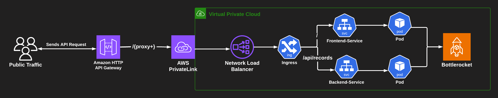

## Architecture:
  - *Create an EKS Cluster using Auto mode or Standard Mode*
  - Key considerations while using either of the two Modes
  - *Deploy the relevant addons to the cluster including CoreDNS, Cilium-CNI, Pod Identity Agent, Storage CSI, etc.
  Note: these are deployed automatically as system processes when using Auto Mode.*
  - Implement persistent storage using the CSI drivers (only when auto mode is not been used).
  - Deploy a sample fullstack app with a Frontend, Backend and Database in a segregatted namespace to test the cluster.
  - Securely expose microservices running in the cluster to external traffic using HTTP API Gateway, VPC Private Link, NLB/ALB, Gateway API, Route or Ingress.
  - AWS Services like HTTP API Gateway should be provisioned using kubernetes native configurations (CRDs)
  
  

#### Prerequisite: Install eksctl, kubectl, aws-cli

#### Create Kubernetes Cluster with EKSCTL - Standard Mode
  - Addons: CoreDNS, EBS CSI Driver and eks-pod-identity-agent

```bash 
export CLUSTER_NAME=basic-cluster
export AWS_REGION=us-east-1
```

```bash
eksctl create cluster -f cluster.yml
```
## OR

#### Create Kubernetes Cluster with EKSCTL in Auto Mode
  - When you create a cluster using Auto-Mode you don't need enable pod-identity as it's done automatically.
  - Other Addons (CoreDNS, VPC-CNI, Kube Proxy etc.) are also added automatically as systemd processess.
  - This service will set you back an additional 12% on top of the standard on-demand EC2 instance pricing for the data plane. That means an additional 12% cost for every instance running in EKS Auto Mode. AWS Auto Mode prices are not affected by instance discounts from Spot, RI, Savings plans ect. You pay for the management of the compute resources provisioned, in addition to your regular EC2 costs. 
```bash
eksctl create cluster -f auto-mode-cluster.yml
```

#### Create pod identity association for Cilium operator service account, giving it the required permissions, aws-load-balancer-controller and ack-apigatewayv2-controller (Not required when Auto mode is enabled).
[Amazon EKS Pod Identity](https://aws.amazon.com/blogs/containers/amazon-eks-pod-identity-a-new-way-for-applications-on-eks-to-obtain-iam-credentials/)

```bash
eksctl create podidentityassociation -f pod-identity.yml
```

#### Deploy Managed NodeGroups.
#### Create NodeGroup
  - AMI is BottleRocket
  - Taint the Nodes (application pods are not scheduled/executed until Cilium is deployed)
```bash
eksctl create nodegroup -f nodegroup.yml
```

#### Create NodePool and NodeClass using Karpenter

#### Deploy the AWS Load Balancer Controller (Not required while using Auto Mode)
[Install ALB Controller with Helm](https://docs.aws.amazon.com/eks/latest/userguide/lbc-helm.html)

```bash
## Get EKS cluster VPC ID
export AGW_VPC_ID=$(aws eks describe-cluster \
--name $CLUSTER_NAME \
--region $AWS_REGION  \
--query "cluster.resourcesVpcConfig.vpcId" \
--output text)

helm repo add eks https://aws.github.io/eks-charts && helm repo update eks

helm install aws-load-balancer-controller eks/aws-load-balancer-controller \
-n kube-system \
--set clusterName=$CLUSTER_NAME \
--set serviceAccount.create=false \
--set serviceAccount.name=aws-load-balancer-controller \
--set region=$AWS_REGION \
--set vpcId=$AGW_VPC_ID

kubectl get deployment -n kube-system aws-load-balancer-controller
```

#### Install Cilium CNI on the cluster using helm and replace Kube-proxy. (Not required while using Auto Mode)
[Helm install Cilium docs](https://docs.cilium.io/en/stable/installation/k8s-install-helm/)

#### You can install Cilium in either ENI mode or Overlay mode on an EKS cluster.
 - In case of ENI mode, Cilium will manage ENIs instead of the VPC CNI, so the aws-node DaemonSet has to be patched to prevent conflict behavior.
    - set your API_SERVER_IP and API_SERVER_PORT by using `kubectl cluster-info`

#### Before we install Cilium with Gateway API, we need to make sure we install the Gateway API CRDs
[Install standard channels crds](https://gateway-api.sigs.k8s.io/guides/?h=crds#getting-started-with-gateway-api)

```bash
kubectl apply -f https://github.com/kubernetes-sigs/gateway-api/releases/download/v1.2.0/experimental-install.yaml


helm repo add cilium https://helm.cilium.io/ && helm repo update cilium

API_SERVER_IP=$(aws eks describe-cluster --name $CLUSTER_NAME --query "cluster.endpoint" --output text | sed 's|https://||')
API_SERVER_PORT=443

helm install cilium cilium/cilium --version 1.16.4 \
  --namespace kube-system \
  --set eni.enabled=true \
  --set ipam.mode=eni \
  --set egressMasqueradeInterfaces=eth0 \
  --set operator.serviceAccount.name=cilium-operator \
  --set operator.serviceAccount.create=false \
  --set routingMode=native \
  --set kubeProxyReplacement=true \
  --set nodePort.enabled=true \
  --set l7Proxy=true \
  --set endpointRoutes.enabled=true \
  --set k8sServiceHost=${API_SERVER_IP} \
  --set k8sServicePort=${API_SERVER_PORT} \
  --set cluster.name=${CLUSTER_NAME} \
  --set gatewayAPI.enabled=true 


kubectl get gatewayclasses.gateway.networking.k8s.io cilium

```

#### Create a namespace to isolate the application
 - For a namespace that implements Pod Security Standards checkout:
 - [Kubernetes Security Section](./security/README.md)

```bash
kubectl apply -f namespaces/go-3tier-app.yml
```

#### Deploy EBS CSI Driver (Not rquired while using EKS Auto Mode).
 - This is already added as an addon during cluster creation.

 ```bash
 # Get default storage class
 kubectl get storageclass

# Create a Storage Class

# StorageClass when using Auto Mode
cat <<EOF > storage-class-auto.yaml
kind: StorageClass
apiVersion: storage.k8s.io/v1
metadata:
  name: auto-ebs-sc
  annotations:
    storageclass.kubernetes.io/is-default-class: "true"
provisioner: ebs.csi.eks.amazonaws.com
parameters:
  type: gp3                 # Specifies the volume type (gp3)
  fsType: ext4              # Filesystem type  
  iops: "3000"              # Configurable IOPS (min: 3000, max: 16000)
  throughput: "125"         # Throughput in MiB/s (max: 1000 for gp3)   
volumeBindingMode: WaitForFirstConsumer
EOF

kubectl apply -f storage-class-auto.yaml

kubectl get storageclass

# StorageClass when using Standard Mode

 ```

 # Create a PersistentVolumeClaim 

 ```bash
cat <<EOF > mongo-pvc.yaml
kind: PersistentVolumeClaim
apiVersion: v1
metadata:
  name: mongo-pvc
  namespace: go-3tier-app
spec:
  accessModes:
    - ReadWriteOnce
  storageClassName: auto-ebs-sc
  resources:
    requests:
      storage: 1Gi
EOF

kubectl apply -f mongo-pvc.yaml

kubectl get pvc
 ```


#### Deploy app using Deployment, Service, PVC
  - Use ConfigMaps to pass configuration data to the deployments.

```bash
kubectl apply -f app/.

kubectl get svc frontend-service -o jsonpath='{.status.loadBalancer.ingress[0].hostname}'
```
#### Or deploy app using helm

```bash
helm install fullstack-app app-chart
```

#### Test Backend Connectivity internally
```bash

kubectl exec -it <frontend-pod-name> -- curl -X POST http://backend-service/api/record \
-H "Content-Type: application/json" \
-d '{
    "name": "John Doe",
    "age": 30,
    "mobile_number": "1234567890",
    "email": "johndoe@example.com"
}'

kubectl exec -it <frontend-pod-name> -- curl http://backend-service/api/record
```

#### Service Networking
#### Gateway API (Cilium implementation) (North/South Traffic) - accepting traffic into the cluster, create using Helm. This creates an NLB (Network Load Balancer) that accepts external traffic 
  - GatewayClass, deployed when cilium is been installed (gatewayAPI.enabled=true)
  - Gateway
  - HTTPRoute --> Service

```bash
kubectl apply -f gateway.yml

kubectl apply -f httproute.yml
```
## OR

#### [Create an IngressClass to configure an Application Load Balancer](https://docs.aws.amazon.com/eks/latest/userguide/auto-configure-alb.html)
#### Recommended when using auto mode, because the aws vpc cni is backed in as a systemd process and can't be changed to Cilium CNI.

```bash
kubectl apply -f ingress/.

## Check Status
kubectl get ingress -n go-3tier-app
```


#### Deploy ACK Controller for API Gateway
[Installing AWS Service Controllers](https://aws-controllers-k8s.github.io/community/docs/user-docs/install/)
***Helm charts for ACK service controllers can be found in the*** [ACK registry within the Amazon ECR Public Gallery](https://gallery.ecr.aws/aws-controllers-k8s) To find a Helm chart for a specific service, you can go to gallery.ecr.aws/aws-controllers-k8s/$SERVICENAME-chart. For example, the link to the ACK service controller Helm chart for Amazon Simple Storage Service (Amazon S3) is gallery.ecr.aws/aws-controllers-k8s/s3-chart.

*You can use the Helm CLI to log into the ECR public Helm registry and install the chart.*

```bash
export ACK_SYSTEM_NAMESPACE=kube-system
export SERVICE=apigatewayv2
export RELEASE_VERSION=$(curl -sL https://api.github.com/repos/aws-controllers-k8s/${SERVICE}-controller/releases/latest | jq -r '.tag_name | ltrimstr("v")')
export AWS_REGION=us-east-1
export CHART_REPO=oci://public.ecr.aws/aws-controllers-k8s

aws ecr-public get-login-password --region us-east-1 | helm registry login --username AWS --password-stdin public.ecr.aws


helm install --create-namespace -n $ACK_SYSTEM_NAMESPACE ack-$SERVICE-controller \
$CHART_REPO/$SERVICE-chart --version $RELEASE_VERSION --set=aws.region=$AWS_REGION

```

#### Create IAM Role for ACKApiGatewayV2ControllerRole
```bash
aws iam create-role \
  --role-name ACKApiGatewayV2ControllerRole \
  --assume-role-policy-document file://trust-policy.json

aws iam put-role-policy \
  --role-name ACKApiGatewayV2ControllerRole \
  --policy-name VPCLinkPolicy \
  --policy-document file://vpc-link-policy.json

``` 

#### Associate the Role with a Namespace
```bash
eksctl create addon \
  --cluster $CLUSTER_NAME \
  --name eks-pod-identity-agent


eksctl create pod-identity-association \
  --cluster $CLUSTER_NAME \
  --namespace kube-system \
  --role-arn $(aws iam get-role --role-name ACKApiGatewayV2ControllerRole --query "Role.Arn" --output text) \
  --service-account ack-apigatewayv2-controller

```

#### Annotate the Deployment
```
kubectl annotate deployment ack-apigatewayv2-controller-apigatewayv2-chart -n kube-system \
eks.amazonaws.com/pod-identity=$(aws iam get-role --role-name ACKApiGatewayV2ControllerRole --query "Role.Arn" --output text)
```

#### Create API Gateway resources - handling North/South Traffic
  - Create security group for the VPC link:
```bash
AGW_VPCLINK_SG=$(aws ec2 create-security-group \
--description "SG for VPC Link" \
--group-name SG_VPC_LINK \
--vpc-id $AGW_VPC_ID \
--region $AWS_REGION \
--output text \
--query 'GroupId')

```

#### Create a VPC Link for the internal NLB/ALB:
```bash

cat <<EOF > vpc-link.yaml
apiVersion: apigatewayv2.services.k8s.aws/v1alpha1
kind: VPCLink
metadata:
  name: nlb-internal
  namespace: go-3tier-app
spec:
  name: nlb-internal
  securityGroupIDs: 
    - $AGW_VPCLINK_SG
  subnetIDs: 
    - $(aws ec2 describe-subnets \
          --filter Name=tag:kubernetes.io/role/internal-elb,Values=1 \
          --query 'Subnets[0].SubnetId' \
          --region $AWS_REGION --output text)
    - $(aws ec2 describe-subnets \
          --filter Name=tag:kubernetes.io/role/internal-elb,Values=1 \
          --query 'Subnets[1].SubnetId' \
          --region $AWS_REGION --output text)
EOF

kubectl apply -f vpc-link.yaml

kubectl get vpclinks.apigatewayv2.services.k8s.aws -n go-3tier-app

aws apigatewayv2 get-vpc-links --region $AWS_REGION
```


#### Create an AWS HTTP API Gateway Route, VPC Link Integration and Stage: - private integration with AWS VPC ***K8S CRD***
[Apigatewayv2-reference-example](https://github.com/aws-controllers-k8s/community/blob/main/docs/content/docs/tutorials/apigatewayv2-reference-example.md)

[Manage HTTP APIs with the ACK APIGatewayv2 Controller](https://aws-controllers-k8s.github.io/community/docs/tutorials/apigatewayv2-reference-example/)

```bash
# Integration uri should either be for ingress(recommened when using auto mode) or gateway

#### Find the ALB DNS Name from Ingress
ALB_HOSTNAME=$(kubectl get ingress <ingress-name> -n <namespace> -o jsonpath='{.status.loadBalancer.ingress[0].hostname}')

#### Retrieve the ALB ARN Using AWS CLI
ALB_ARN=$(aws elbv2 describe-load-balancers --query "LoadBalancers[?DNSName=='$ALB_HOSTNAME'].LoadBalancerArn" --output text)


API_NAME="ack-api"
INTEGRATION_NAME="private-nlb-integration"
INTEGRATION_URI="$(aws elbv2 describe-listeners \
  --load-balancer-arn $(aws elbv2 describe-load-balancers \
  --region $AWS_REGION \
  --query "LoadBalancers[?contains(DNSName, '$(kubectl get service cilium-gateway-my-gateway \
  -o jsonpath="{.status.loadBalancer.ingress[].hostname}")')].LoadBalancerArn" \
  --output text) \
  --region $AWS_REGION \
  --query "Listeners[0].ListenerArn" \
  --output text)" || INTEGRATION_URI="$ALB_ARN"
ROUTE_NAME="ack-route"
ROUTE_KEY_NAME="ack-route-key"
STAGE_NAME="\$default"

VPC_LINK_ID=$(kubectl get -n go-3tier-app vpclinks.apigatewayv2.services.k8s.aws nlb-internal -o jsonpath='{.status.vpcLinkID}')


cat <<EOF > apigwv2-httpapi.yaml
apiVersion: apigatewayv2.services.k8s.aws/v1alpha1
kind: API
metadata:
  name: "${API_NAME}"
  namespace: go-3tier-app
spec:
  name: "${API_NAME}"
  protocolType: HTTP
  corsConfiguration:
    allowHeaders:
      - content-type
    allowMethods:
      - "*"
    allowOrigins:
      - "*"

---

apiVersion: apigatewayv2.services.k8s.aws/v1alpha1
kind: Integration
metadata:
  name: "${INTEGRATION_NAME}"
  namespace: go-3tier-app
spec:
  apiRef:
    from:
      name: "${API_NAME}"
  integrationType: HTTP_PROXY
  integrationURI: "${INTEGRATION_URI}"
  integrationMethod: "ANY"
  connectionType: VPC_LINK
  connectionID: "$(kubectl get -n go-3tier-app vpclinks.apigatewayv2.services.k8s.aws nlb-internal -o jsonpath='{.status.vpcLinkID}')"
  payloadFormatVersion: "1.0"
  
---

apiVersion: apigatewayv2.services.k8s.aws/v1alpha1
kind: Route
metadata:
  name: "${API_NAME}"
  namespace: go-3tier-app
spec:
  apiRef:
    from:
      name: "${API_NAME}"
  routeKey: "ANY /{proxy+}"
  targetRef:
    from:
      name: "${INTEGRATION_NAME}"

---

apiVersion: apigatewayv2.services.k8s.aws/v1alpha1
kind: Stage
metadata:
  name: "default"
  namespace: go-3tier-app
spec:
  apiRef:
    from:
      name: "${API_NAME}"
  stageName: "${STAGE_NAME}"
  autoDeploy: true
  description: "auto deployed stage for ${API_NAME}"
EOF

kubectl apply -f apigwv2-httpapi.yaml

kubectl get apis.apigatewayv2.services.k8s.aws ack-api -o jsonpath='{.status.apiEndpoint}'

```


