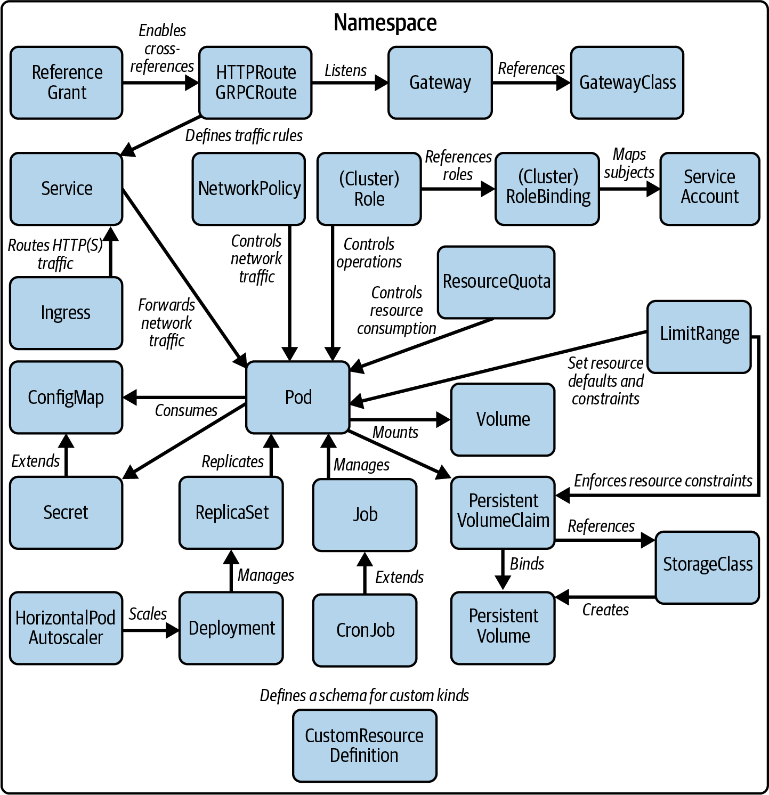
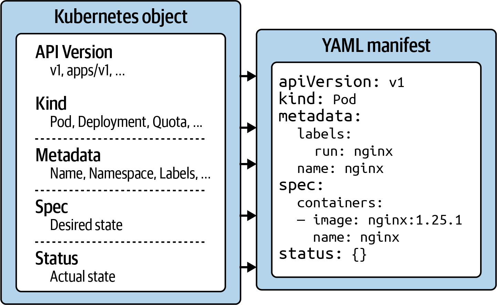
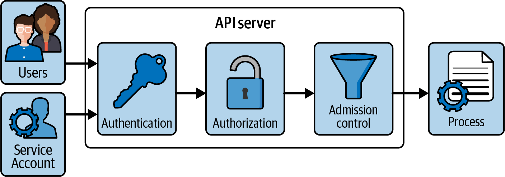
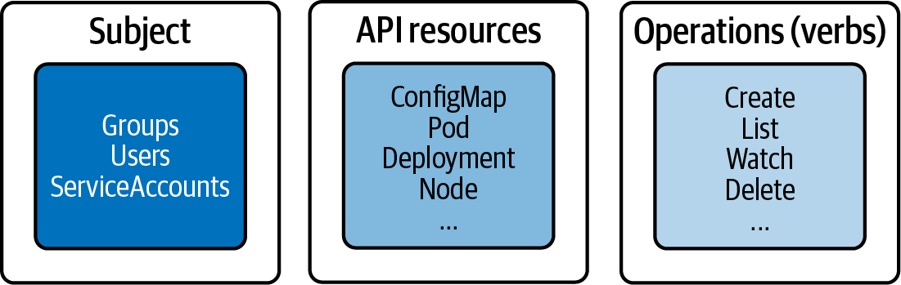
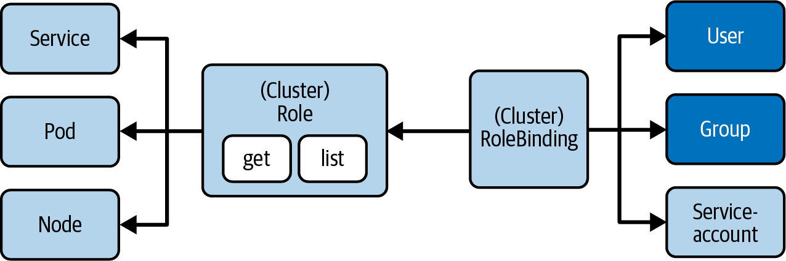

**CKA Objectives**: **_Typical administrator tasks encountered on the job, more specifically, Kubernetes cluster maintenance, networking, storage solutions, and troubleshooting applications and cluster nodes_**.

**_The following overview lists the high-level sections, or domains, of the exam and their scoring weights_**:

- 25%: Cluster Architecture, Installation, and Configuration:
  - This section dives deep into fundamental architecture of K8s, including the distinction between the control plane and worker nodes, high-availability configurations, and tools needed for installing, upgrading, and maintaining a cluster. You will learn practical skills such as installing a cluster from scratch, upgrading its version, and backing up/restoring the etcd database.
    **_The CNCF has also incorporated related topics into this domain. For instance, mastering role-based access control (RBAC) is essential for administrators to effectively manage access to cluster resources. You’ll also become proficient in installing Kubernetes operators and using tools like Kustomize and Helm to discover and deploy cluster components efficiently._**
- 15%: Workloads and Scheduling:
  - Administrators must have a solid understanding of Kubernetes concepts essential for managing cloud native applications. The domain focuses on these critical aspects. It covers key resources such as Deployments, ReplicaSets, and configuration management using ConfigMaps and Secrets.
    **_When a new Pod is created, the Kubernetes scheduler assigns it to an available node based on predefined criteria. Scheduling rules, such as node affinity and taints/tolerations, help fine-tune this process to meet specific requirements._**
- 20%: Servicing and Networking:
  - A cloud native microservice rarely operates in isolation. More often than not, it interacts with other microservices or external systems. For administrators, understanding Pod-to-Pod communication, exposing applications to external clients, and configuring cluster networking is crucial for maintaining a fully functional system.
    **_This domain of the exam evaluates your knowledge of essential Kubernetes networking primitives, including Services, Ingress, NetworkPolicy, and the Gateway API._**
- 10%: Storage:
  - This domain focuses on the various types of volumes used for reading and writing data in Kubernetes. As an administrator, you must understand how to create, configure, and manage these volumes effectively.
    **_PersistentVolumes (PVs) play a crucial role in ensuring data persistence, even after a cluster node restarts. You’ll need to demonstrate the ability to mount a PersistentVolume to a specific path within a container and understand the underlying mechanics. Additionally, it’s essential to grasp the differences between static and dynamic provisioning to manage storage resources efficiently._**
- 30%: Troubleshooting:
  - In production Kubernetes clusters, issues are bound to arise. Applications may misbehave, become unresponsive, or even become completely inaccessible. Additionally, cluster nodes might crash or face configuration problems. Developing effective troubleshooting strategies is critical to quickly identifying and resolving these situations to minimize downtime and disruption.

### Involved Kubernetes Primitives



**Documentation**
During the exam, you are permitted to open a well-defined list of web pages as a reference. You can freely browse those pages and copy-paste code to the exam terminal. The official Kubernetes documentation includes the reference manual and the blog. In addition, you can also browse the Helm documentation:

[Reference manual](https://kubernetes.io/docs)
[Blog](https://kubernetes.io/blog)
[Helm](https://helm.sh/docs)

**kubectl** - (for interacting with the Kubernetes cluster)

**kubeadm** - (for installing a Kubernetes cluster from scratch and upgrading the Kubernetes version of an existing cluster)

**etcdctl and etcdutl** - (for backing up and restoring the etc database)
Static Pods

**vi or vim** - text editor in linux
**grep, awk, sed\*** - text processing in linux
**cat, less, head, tail** - file operations
**netstat, curl, wget** - basic networking commands

**Setting a Context and Namespace**
The exam environment comes with multiple Kubernetes clusters already set up for you.
Each of the exam tasks need to be solved on a designated cluster.

```bash
kubectl config set-context <context-of-question> \
  --namespace=<namespace-of-question>

kubectl config use-context <context-of-question>

# Using the Alias for kubectl
alias k=kubectl
k version

# Using kubectl Command Auto-Completion

```

**Control Plane Node Components**
The control plane node requires a specific set of components to perform its job. The following list of components will give you an overview:

- API server: The API server exposes the API endpoints clients use to communicate with the Kubernetes cluster. For example, if you execute the tool kubectl, a command-line based Kubernetes client, you will make a RESTful API call to an endpoint exposed by the API server as part of its implementation. The API processing procedure inside of the API server will ensure aspects like authentication, authorization, and admission control.
- Schedular: The scheduler is a background process that watches for new Kubernetes Pods with no assigned nodes and assigns them to a worker node for execution
- Controller manager: The controller manager watches the state of your cluster and implements changes where needed. For example, if you make a configuration change to an existing object, the controller manager will try to bring the object into the desired state.
- etcd: Cluster state data needs to be persisted over time so it can be reconstructed upon a node restart or even a full cluster restart. That’s the responsibility of etcd, an open source software Kubernetes integrates with. At its core, etcd is a key-value store used to persist all data related to the Kubernetes cluster.

**Common Node Components**:
Kubernetes employs components that are leveraged by all nodes independent of their specialized responsibility:

- Kubelet: The kubelet runs on every node in the cluster; however, it makes the most sense on a worker node. This is because the control plane node usually doesn’t execute workload, and the worker node’s primary responsibility is to run workload. The kubelet is an agent that makes sure that the necessary containers are running in a Pod. You could say that the kubelet is the glue between Kubernetes and the container runtime engine and ensures that containers are running and healthy.
- Kube-proxy: The kube-proxy is a network proxy that runs on each node in a cluster to maintain network rules and enable network communication. In part, this component is responsible for implementing the Service concept.
- Container runtime: the container runtime is the software responsible for managing containers. The kubelet can be configured to choose from a range of different container runtime engines. While you can install a container runtime engine on a control plane, it’s not necessary, as the control plane node usually doesn’t handle workload.

**API Primitives and Objects**
Every Kubernetes primitive follows a general structure, which you can observe if you look deeper at a manifest of an object.


**Using kubectl**
kubectl is the primary tool for interacting with the Kubernetes clusters from the command line. The exam is exclusively focused on the use of kubectl.

```bash
kubectl [command] [TYPE] [NAME] [flags]
```

The command specifies the operation you’re planning to run. Typical commands are verbs like create, get, describe, or delete. Next, you’ll need to provide the resource type you’re working on, either as a full resource type or its short form. For example, you could work on a service here or use the short form, svc.
The name of the resource identifies the user-facing object identifier, effectively the value of metadata.name in the YAML representation.
Finally, you can provide zero to many command-line flags to describe additional configuration behavior. A typical example of a command-line flag is the --port flag, which exposes a Pod’s container port.


A crucial time-saving tool during the exam is kubectl explain, which provides instant access to resource specifications without needing to search documentation. For example, kubectl explain pods.spec.containers shows all available container configuration fields, while kubectl explain deployment.spec.strategy.rolling​Up⁠date details rolling update parameters.

**Imperative Object Management**
Imperative object management does not require a manifest definition. You’ll use kubectl to drive the creation, modification, and deletion of objects with a single command and one or many command-line options.

**_Creating objects_**
Use the run or create command to create an object on the fly. Any configuration needed at runtime is provided by command-line options.

```bash
# The following run command creates a Pod named frontend that executes the container image nginx:1.29.0 in a container with the exposed port 80:
kubectl run frontend --image=nginx:1.29.0 --port=80
```

**_Updating objects_**
The configuration of live objects can still be modified. kubectl supports this use case by providing the edit and patch commands.

```bash
kubectl edit pod frontend
```

**_Deleting objects_**
You can delete a Kubernetes object at any time. During the exam, the need may arise if you made a mistake while solving a problem and want to start from scratch to ensure a clean slate.
Upon execution of the delete command, Kubernetes tries to delete the targeted object gracefully so that there’s minimal impact on the end user.
During the exam, end-user impact is not a concern. The most important goal is to complete all tasks in the time granted to the candidate. Therefore, waiting on an object to be deleted gracefully is a waste of time. You can force an immediate deletion of an object with the command-line option --now.

```bash
#The following command terminates the Pod named nginx using a SIGKILL signal:
$ kubectl delete pod nginx --now
```

### Creating and Managing a Kubernetes Cluster

Set up the underlying infrastructure for installing a Kubernetes cluster:
**_The infrastructure required by Kubernetes cluster nodes consist of servers, networks, and storage._**

- 3 EC2 (Control Plane and 2 Worker nodes) and 2 different Security Groups
- Check the Kubernetes documentation for the minimum CPU and Memory requirements

### What applications do you need to install

- Deploy a container runtime on every node(Control Plane / Worker), so that containers can be scheduled on them.
- Install the Kubelet application also on every node, which will basically run as a regular Linux process, just like the container runtime. They will both be installed from a package repository, just like we install any application on Linux servers.
- With the Container runtime and Kubelet in place, we can now deploy Pods for other K8s components.
  - On the Control plane nodes (We need to now deploy pods that run the master applications):
    - Api Server, Scheduler, Controller Manager, and ETCD applications will all be deployed as Pods on the Master nodes
  - The Kube Proxy application will be deployed on every node and runs as a Pod.
  - There are two things we need in order to deploy these Pod applications:
    - Since all these applications are pods, we need the Kubernetes manifest files for each application.
    - We must also make sure these applications are deployed securely: This means unauthorized users shouldn’t be able to access these applications, and the applications should talk to each other in an encrypted way.

**Chicken and Egg Situation**: All Master components will be deployed as Pods, but we need the Master components to deploy Pods.

- Because when deploying a Pod, we need to send a request to the API server > the Scheduler component will decide where to run the Pod > and the Pod data will be written into etcd.
- As you see, when scheduling one Pod, all the master components are involved, so how do we schedule these components without having them in the cluster? So we have the chicken and the egg problem; the answer to this is Static Pods.
- Static Pods are just like any other pods, but they are directly scheduled by the kublet without the need for API server, scheduler, or etcd.
- Once we have the Container Runtime and Kublet running, we can actually schedule these static pods.

### Regular Pod Scheduling:

- API Server gets the request > Scheduler (decides which node to place the Pod) > API server contacts Kubelet on the Node Scheduler selected to schedule the Pod.

### Static Pod Scheduling:

- Kubelet schedules Pod: How does it happen? Kubelete continuously watches a specific location on the Node it is running on. That location is /etc/kubernetes/manifests. It watches the folder for any Kubernetes manifest files. It schedules Pods as static Pods with no master processes required.
- Kubelet (Not Controller Manager) watches static Pod and restarts if it fails
- Pod names are suffixed with the node hostname
  **_This all means that when installing a Kubernetes cluster, we would first need to generate static Pod manifests for the API Server, Controller Manager, Scheduler, and etcd applications, and put these manifest files in the “/etc/kubernetes/manifests” folder, where Kubelet would find them and schedule them._**

### Certificates

When deploying these applications, we need to ensure that they will run securely. The question is, how do they talk to each other securely, and how can each component identify the other components, and also establish a mutual TLS communication so that communication between them is encrypted? We need certificates for that.

Who talks to whom in a Kubernetes cluster? And what certificate do we need for that?

- The API server is at the center of everything and all the communication. Almost every other component will talk to the API server; every component that wants to talk to the API server will need to provide a certificate to be able to authenticate itself with the API server.
- The way it works is, we need to first generate a self-signed CA certificate for Kubernetes (“cluster root CA”), which we will use to sign all the client and server certificates for each component in the cluster.
- These certificates are stored in the “/etc/kubernetes/pki” folder. The API server will have a server certificate, and the Scheduler and Controller Manager will both have their client certificate to talk to the API server. Same way API server talks to etcd and kubelet applications, which means etcd and kubelet will need their own server certificates, and since in this case API server is the client, it will need its own client certificate.
- PKI certificates for Authentication. Each component gets a certificate, signed by the same certificate authority.
- There’s one more client that we need to give a certificate or cluster access to, and that’s ourselves as Admins of the cluster, because we as Admins also need to talk to the server to administer it. All the queries and updates in the cluster go through the API server, and this means we also need our own client certificate for the Admin user to authenticate to the API server. To be valid and accepted by the API server, this certificate also needs to be signed by the CA that we created in Kubernetes.

This entire process is complex and time-consuming when done manually. The command-line tool Kubeadm bootstraps all these, providing “fast paths” for creating K8s clusters.

- It cares only about bootstrapping, not about provisioning machines.
  [Use the Kubernetes documentation as a guide to set up a cluster](https://kubernetes.io/docs/setup/production-environment/tools/kubeadm/install-kubeadm/)

- Once the underlying infrastructure is provisioned, we need to check our prerequisites and configure a couple of things on those servers so that Kubernetes can work on them properly after installation.
- 2 GB or more RAM per machine (any less will leave little room for your apps).
- 2 CPUs or more for control plane machines.
- All machines must be on the same network
- Unique hostnames, Mac address, and product_uuid for every node.
- Your firewall should allow certain ports.
- Swap disabled. You must disable swap in order for kubelet to work properly.

### Swap configuration:

- The default behavior of a kubelet is to fail to start if swap memory is detected on a node. This means that swap should either be disabled or tolerated by kubelet on every server(node).
  - To disable swap, sudo swapoff -a can be used to disable swapping temporarily. To make this change persistent across reboots, make sure swap is disabled in config files like /etc/fstab, systemd.swap, depending how it was configured on your system.
- [List of ports to be allowed on the different nodes (Control Plane / Worker nodes)](https://kubernetes.io/docs/reference/networking/ports-and-protocols/)

Control plane

| Protocol | Direction | Port Range | Purpose                 | Used By              |
| -------- | --------- | ---------- | ----------------------- | -------------------- |
| TCP      | Inbound   | 6443       | Kubernetes API server   | All                  |
| TCP      | Inbound   | 2379-2380  | etcd server client API  | kube-apiserver, etcd |
| TCP      | Inbound   | 10250      | Kubelet API             | Self, Control plane  |
| TCP      | Inbound   | 10259      | kube-scheduler          | Self                 |
| TCP      | Inbound   | 10257      | kube-controller-manager | Self                 |

Although etcd ports are included in the control plane section, you can also host your own etcd cluster externally or on custom ports.

| Protocol | Direction | Port Range  | Purpose            | Used By              |
| -------- | --------- | ----------- | ------------------ | -------------------- |
| TCP      | Inbound   | 10250       | Kubelet API        | Self, Control plane  |
| TCP      | Inbound   | 10256       | kube-proxy         | Self, Load balancers |
| TCP      | Inbound   | 30000-32767 | NodePort Services† | All                  |
| UDP      | Inbound   | 30000-32767 | NodePort Services† | All                  |

Default port range for [NodePort Services](https://kubernetes.io/docs/concepts/services-networking/service/)

All default port numbers can be overridden. When custom ports are used those ports need to be open instead of defaults mentioned here.

One common example is API server port that is sometimes switched to 443. Alternatively, the default port is kept as is and API server is put behind a load balancer that listens on 443 and routes the requests to API server on the default port.

- Optimize the process by giving the servers(nodes) a more human readable names.

```bash
sudo /etc/hosts
Map Private IP address(172.31.44.219) - name(Master)
Make an entry for all nodes


Sudo hostnamectl set-hostname control_plane

```

### Install a container runtime on every node

Install Containerd using Docker’s apt repository.

Create a Bash script to make this easier. (install.sh)

Make the file executable; chmod u+x install.sh

```bash
# Add Docker's official GPG key:
sudo apt -y update
sudo apt -y install ca-certificates curl
sudo install -m 0755 -d /etc/apt/keyrings
sudo curl -fsSL https://download.docker.com/linux/ubuntu/gpg -o /etc/apt/keyrings/docker.asc
sudo chmod a+r /etc/apt/keyrings/docker.asc


# Add the repository to Apt sources:
sudo tee /etc/apt/sources.list.d/docker.sources <<EOF
Types: deb
URIs: https://download.docker.com/linux/ubuntu
Suites: $(. /etc/os-release && echo "${UBUNTU_CODENAME:-$VERSION_CODENAME}")
Components: stable
Signed-By: /etc/apt/keyrings/docker.asc
EOF


sudo apt -y update


sudo apt -y install containerd.io
sudo systemctl --no-pager status containerd.service
sudo systemctl is-active containerd.service


# Check if cri is disabled
cat /etc/containerd/config.toml


# Remove config
sudo rm /etc/containerd/config.toml


sudo mkdir -p /etc/containerd && sudo containerd config default | sudo tee /etc/containerd/config.toml


#Configure containerd to use systemd cgroup driver for compatibility with kubeadm:
sudo sed -i 's/SystemdCgroup = false/SystemdCgroup = true/' /etc/containerd/config.toml


sudo systemctl restart containerd
sudo systemctl status containerd --no-pager
#Verify CRI is working
sudo crictl --runtime-endpoint unix:///var/run/containerd/containerd.sock version


#Enable IPV4 packet forwarding
#To manually enable IPV4 packet forwarding
# sysctl params required by setup, params persist across reboots


cat <<EOF | sudo tee /etc/sysctl.d/k8s.conf
net.ipv4.ip_forward = 1
EOF


# Apply sysctl params without reboot
sudo sysctl --system


#Verify that net.ipv4.ip_forward is set to 1 with:
sysctl net.ipv4.ip_forward

```

### Install Kubernetes Processes

- Install kubeadm and kubelet on each Node, kubectl on the control-plane node.
- Execute kubeadm init (once): this is to initialize a control-plane Node, which will orchestrate the whole Kubernetes setup.
  - It will generate /etc/kubernetes folder
  - Generates a self-signed CA to set up identities for each component
  - Generates static Pod manifest files into /etc/kubernetes/manifests
  - Makes all necessary configurations
  - Kubelet will detect manifest files and start the Pods with the suffix of the hostname
  - Kubeadm does not install or manage kubelet for you
  - Before the cluster is initialized, first install Kubelet: it starts pods and containers
  - When we create a cluster, we need to interact with it to administer it, so we install a Kubernetes client command line tool, Kubectl.

**_These instructions are for Kubernetes v1.34._**

```bash
#1. Update the apt package index and install packages needed to use the Kubernetes apt repository:
sudo apt-get update
# apt-transport-https may be a dummy package; if so, you can skip that package
sudo apt-get install -y apt-transport-https ca-certificates curl gpg


#2. Download the public signing key for the Kubernetes package repositories. The same signing key is used for all repositories, so you can disregard the version in the URL:
# If the directory `/etc/apt/keyrings` does not exist, it should be created before the curl command, read the note below.


# sudo mkdir -p -m 755 /etc/apt/keyrings
curl -fsSL https://pkgs.k8s.io/core:/stable:/v1.34/deb/Release.key | sudo gpg --dearmor -o /etc/apt/keyrings/kubernetes-apt-keyring.gpg


#3. Add the Kubernetes apt repository.
# This overwrites any existing configuration in /etc/apt/sources.list.d/kubernetes.list


echo 'deb [signed-by=/etc/apt/keyrings/kubernetes-apt-keyring.gpg] https://pkgs.k8s.io/core:/stable:/v1.34/deb/ /' | sudo tee /etc/apt/sources.list.d/kubernetes.list


#4. Update the apt package index, install kubelet, kubeadm and kubectl, and pin their version:
sudo apt-get update
sudo apt-get install -y kubelet kubeadm kubectl
sudo apt-mark hold kubelet kubeadm kubectl


#5. (Optional) Enable the kubelet service before running kubeadm:
sudo systemctl enable --now kubelet
```

To initialize the control-plane node run:

```bash
sudo kubeadm init <args>
```

Kubeadm init phases [preflight, certs, kubeconfig, kubelet-start, control-plane]

- Addons: kubeadm installs a DNS server (CoreDNS) and the kube-proxy addon components via the API server.

Kubelete runs as a system process and lives in the /var/lib/kubelet/ folder.

### How do we access the cluster once configured?

Kubeconfig & kubectl: Connect to cluster

```bash
mkdir -p $HOME/.kube
sudo cp -i /etc/kubernetes/admin.conf $HOME/.kube/config
sudo chown $(id -u):$(id -g) $HOME/.kube/config
```

### [Kubectl auto completion](https://kubernetes.io/docs/tasks/tools/install-kubectl-linux/#enable-shell-autocompletion) and set an alias

```bash
echo 'source <(kubectl completion bash)' >>~/.bashrc
echo 'alias k=kubectl' >> ~/.bashrc
echo 'complete -o default -F __start_kubectl k' >>~/.bashrc


source ~/.bashrc
```

Regenerate the command to join nodes to the cluster.

```bash
kubeadm token create –print-join-command
```

### Pod Networking

- Every Pod has a unique IP address across the cluster.
- IP address reachable from all other Pods in the K8s cluster
- Kubernetes doesn’t have an in-built solution for pod networking
- The cluster operator is expected to implement a networking solution (CNI), Container Networking Interface, eg, Cilium, flannel, etc.

### [Install Cilium as CNI and Kube-proxy replacement](https://docs.cilium.io/en/stable/gettingstarted/k8s-install-default/)

- Install the Cilium CLI

```bash
CILIUM_CLI_VERSION=$(curl -s https://raw.githubusercontent.com/cilium/cilium-cli/main/stable.txt)
CLI_ARCH=amd64
if [ "$(uname -m)" = "aarch64" ]; then CLI_ARCH=arm64; fi
curl -L --fail --remote-name-all https://github.com/cilium/cilium-cli/releases/download/${CILIUM_CLI_VERSION}/cilium-linux-${CLI_ARCH}.tar.gz{,.sha256sum}
sha256sum --check cilium-linux-${CLI_ARCH}.tar.gz.sha256sum

sudo tar xzvfC cilium-linux-${CLI_ARCH}.tar.gz /usr/local/bin

rm cilium-linux-${CLI_ARCH}.tar.gz{,.sha256sum}

```

### [Initializing Cluster without Kube-proxy and installing Cilium using Helm](https://docs.cilium.io/en/stable/network/kubernetes/kubeproxy-free/)

### List resources that are cluster-scoped or namespaced

```bash
Kubectl api-resources –namespaced=false
```

### Explore available fields for every Kubernetes resource with the explain command.

As a parameter, provide the JSONPath of the object you’d like to render details for.

```bash
​​kubectl explain pods.spec
```

### DNS

Kubelet supplies each Pod with the DNS server location at /etc/resolv.conf
Configuration for kubelet is located at /var/lib/kubelet/config.yaml

- Service fully qualified domain name(FQDN):
  <servicename>.<namespace>.svc.cluster.local
  nginx-svc.default.svc.cluster.local

- Configure Service IP Address:
  - How Service Names are mapped to IP Addresses:
    Services IP address range is defined in Kube API Server Configuration located at /etc/kubernetes/manifests/kube-apiserver.yaml
    --service-cluster-ip-range=10.96.0.0/12
    These are internal service IP Addresses that only the applications in the cluster can use to access the services.
  - Kubeadm provisions and creates the Kube API server configuration, so how does Kubeadm actually get the Service AIP Address range?
    If we look at the kubeadm init --help command and it's options, one of the options we see is --service-cidr and its default range is "10.96.0.0/12", you can also specify an alternative IP Address range.
  - Check for the Kubeadm default configuration values:
    kubeadm config print init-defaults
    Gives you a list of all the default values kubeadm will initialize your cluster with.

### Upgrading a Cluster Version

Over time, you will want to upgrade the Kubernetes version of an existing cluster to pick up bug fixes and new features. The upgrade process has to be performed in a controlled manner to avoid the disruption of workload currently in execution and to prevent the corruption of cluster nodes.
**_It is recommended to upgrade from a minor version to a next higher one (e.g., from 1.31.0 to 1.32.0), or from a patch version to a higher one (e.g., from 1.31.0 to 1.31.3). Abstain from jumping up multiple minor versions to avoid unexpected side effects._**

- Determine upgrade version, Install new kubeadm version, kubeadm upgrade plan, kubeadm upgrade apply, Drain workload on node, Upgrade kubelet and kubectl, Restart kubelet process, Allow new workload on node.

**Upgrading Control Plane Nodes**

```bash
sudo apt update
sudo apt-cache madison kubeadm

# Upgrade kubeadm to a target version. Say you’d want to upgrade to version 1.31.5-1.1.
sudo apt-mark unhold kubeadm && sudo apt-get update && sudo apt-get install \
  -y kubeadm=1.31.5-1.1 && sudo apt-mark hold kubeadm

# Check which versions are available to upgrade to and validate whether your current cluster is upgradable.
sudo kubeadm upgrade plan

sudo kubeadm upgrade apply v1.31.5

# Drain the control plane node by evicting the workload. Any new workload won’t be schedulable on the node until uncordoned:
kubectl drain kube-control-plane --ignore-daemonsets

# Upgrade the kubelet and the kubectl tool to the same version:
sudo apt-mark unhold kubelet kubectl && sudo apt-get update && sudo \
  apt-get install -y kubelet=1.31.5-1.1 kubectl=1.31.5-1.1 && sudo apt-mark \
  hold kubelet kubectl

# Restart the kubelet process:
sudo systemctl daemon-reload
sudo systemctl restart kubelet

# Reenable the control plane node so that the new workload can become schedulable:
kubectl uncordon kube-control-plane

# The control plane node should now show the usage of Kubernetes 1.31.5:
kubectl get nodes


```

**Upgrading Worker Nodes**

```bash
# Upgrade kubeadm to a target version. This is the same command you used for the control plane node
sudo apt-mark unhold kubeadm && sudo apt-get update && sudo apt-get install \
  -y kubeadm=1.31.5-1.1 && sudo apt-mark hold kubeadm

# Upgrade the kubelet configuration:
sudo kubeadm upgrade node

# Drain the worker node by evicting the workload. Any new workload won’t be schedulable on the node until uncordoned:
kubectl drain kube-worker-1 --ignore-daemonsets

# Upgrade the kubelet and the kubectl tool with the same command used for the control plane node:
sudo apt-mark unhold kubelet kubectl && sudo apt-get update && sudo apt-get \
  install -y kubelet=1.31.5-1.1 kubectl=1.31.5-1.1 && sudo apt-mark hold kubelet \
  kubectl

# Restart the kubelet process:
sudo systemctl daemon-reload
sudo systemctl restart kubelet

# Reenable the worker node so that the new workload can become schedulable:
kubectl uncordon kube-worker-1
```

### Backing Up and Restoring etcd

Kubernetes stores both the declared and observed states of the cluster in the distributed etcd key-value store. It’s important to have a backup plan in place that can help you with restoring the data in case of data corruption. Backing up the data should happen periodically in short time frames to avoid losing as much historical data as possible.

**Using the etcd Administration Utilities**

The backup process stores the etcd data in a snapshot file. This snapshot file can be used to restore the etcd data at any given time. You can encrypt the snapshot file to protect sensitive information. The tool etcdctl is used to create a backup snapshot file. Restoring the etcd data from the snapshot file requires the use of the tool etcdutl.

**Backing Up etcd**
The describe command reveals the configuration of the etcd service. Look for the value of the option --listen-client-urls for the endpoint URL. In the following output, the host is localhost, and the port is 2379. The server certificate is located at /etc/kubernetes/pki/etcd/server.crt defined by the option --cert-file. The CA certificate can be found at /etc/kubernetes/pki/etcd/ca.crt specified by the option --trusted-ca-file:

Use the etcdctl command to create the backup with version 3 of the tool.
Provide the mandatory command-line options --cacert, --cert, and --key. The option --endpoints is not needed as we are running the command on the same server as etcd. After running the command, the file /opt/etcd-backup.db has been created:

```bash
sudo ETCDCTL_API=3 etcdctl --cacert=/etc/kubernetes/pki/etcd/ca.crt \
  --cert=/etc/kubernetes/pki/etcd/server.crt \
  --key=/etc/kubernetes/pki/etcd/server.key \
  snapshot save /opt/etcd-backup.db
```

**Restoring etcd**
To restore etcd from the backup, use the etcdutl snapshot restore command. At a minimum, provide the --data-dir command-line option.

```bash
sudo ETCDCTL_API=3 etcdutl --data-dir=/var/lib/from-backup snapshot restore \
  /opt/etcd-backup.db

# Edit the YAML manifest of the etcd Pod, which can be found at /etc/kubernetes/manifests/etcd.yaml. Change the value of the attribute spec.volumes.hostPath with the name etcd-data from the original value /var/lib/etcd to /var/lib/from-backup:
```

### Authentication, Authorization, and Admission Control

The API server is the gateway to the Kubernetes cluster. Any human user, client (e.g., kubectl), cluster component, or service account will access the API server by making a RESTful API call via HTTPS. It is the central point for performing operations like creating a Pod or deleting a Service.

The first stage of request processing is authentication. Authentication validates the identity of the caller by inspecting the client certificates or bearer tokens. If the bearer token is associated with a service account, then it will be verified here.


The second stage determines if the identity provided in the first stage can access the verb and HTTP path request. Therefore, stage two deals with authorization of the request, which is implemented with the standard Kubernetes RBAC model. Here, we ensure that the service account is allowed to list Pods or create a new Service object if that has been requested.

The third stage of request processing deals with admission control. Admission control verifies whether the request is well formed or potentially needs to be modified before the request is processed. An admission control policy could, for example, ensure that the request for creating a Pod includes the definition of a specific label. If the request doesn’t define the label, then it is rejected.

**Authentication with kubectl**
Developers interact with the Kubernetes API by running the kubectl command-line tool. Whenever you execute a command with kubectl, the underlying HTTPS call to the API server needs to authenticate.

**_The Kubeconfig_**
Credentials for the use of kubectl are stored in the file $HOME/.kube/config, also known as the kubeconfig file. The kubeconfig file defines the API server endpoints of the clusters we want to interact with, as well as a list of users registered with the cluster, including their credentials in the form of client certificates. The mapping between a cluster and user for a given namespace is called a context. kubectl uses the currently selected context to know which cluster to talk to and which credentials to use.

User management is handled by the cluster administrator. The administrator creates a user representing the developer and hands the relevant information (username and credentials) to the human wanting to interact with the cluster via kubectl. Alternatively, it is also possible to integrate with external identity providers for authentication purposes, e.g., via OpenID Connect.

**Managing Kubeconfig Using kubectl**
You do not have to manually edit the kubeconfig file(s) to change or add configuration. kubectl provides commands for reading and modifying its contents.

```bash
# To view the merged contents of the kubeconfig file(s), run the following command:
kubectl config view

# To render the currently selected context, use the current-context subcommand.
kubectl config current-context

# To change the context, provide the name with the use-context subcommand.
kubectl config use-context bmuschko

# To register a user with the kubeconfig file(s), use the set-credentials subcommand. We are choosing to assign the username myuser and point to the client certificate by providing the corresponding CLI flags:
kubectl config set-credentials myuser \
  --client-key=myuser.key --client-certificate=myuser.crt \
  --embed-certs=true


```

**Create user using x509 certificates**

```bash
# Log into the Kubernetes control plane node and create a temporary directory that will hold the generated keys. Navigate into the directory:
mkdir cert && cd cert

# 1. Create a private key using the openssl executable. Provide an expressive file name, such as <username>.key:
 openssl genrsa -out dev-tom.key 2048

# 2. Create a certificate sign request (CSR) in a file with the extension .csr. You need to provide the private key from the previous step. The -subj option provides the username (CN) and the group (O). The following command uses the username dev-tom and the group named cka-study-guide. To avoid assigning the user to a group, leave off the /O component of the assignment:
openssl req -new -key dev-tom.key -subj "/CN=tom/O=cka-study-guide" -out dev-tom.csr

# Lastly, sign the CSR with the Kubernetes cluster certificate authority (CA). The CA can usually be found in the directory /etc/kubernetes/pki and needs to contain the files ca.crt and ca.key. The following command signs the CSR and makes it valid for 364 days:

openssl x509 -req -in dev-tom.csr -CA /etc/kubernetes/pki/ca.crt -CAkey \
  /etc/kubernetes/pki/ca.key -CAcreateserial -out dev-tom.crt -days 364

  # OR

# 3. Send CSR using K8s Certificates API
kubectl apply -f - <<EOF
apiVersion: certificates.k8s.io/v1
kind: CertificateSigningRequest
metadata:
  name: dev-tom
spec:
  request:
LS0tLS1CRUdJTiBDRVJUSUZJQ0FURSBSRVFVRVNULS0tLS0KTUlJQ1V6Q0NBVHNDQVFBd0RqRU1NQW9HQTFVRUF3d0RkRzl0TUlJQklqQU5CZ2txaGtpRzl3MEJBUUVGQUFPQwpBUThBTUlJQkNnS0N
BUUVBanQrY3g0YjYwK3QxcVZjcDRZVlEzTC9oTWJSNVdvRDFqdnk4M0EvdDlFMUJYMDcxCm9Fd1JIeVlVd2tmeUJBcFBiQm5BZlZEZjR3TGhYMDBXa2NtMXBiekp1S0EyM3IyTGFZUkxGR1MxTHk1VmpFNzAKKzhUO
VVpenU1c2EvZzE4VlJ2SWlXaCtiZzR5SHovWitFNE11eUppMFJkdUVTSERGMkFZbzVISW0veUIrL2hOaQp4bEpJSHVOMFFLeENqVlZCTlRiM0hxZVZYMUg3TWFPektWdzQ5WTJYWGdqM1hYMGFESDY3Ny8rZFlud2l
oYk1xClJzY1IyenZwbTlOL0RXQllNZWZDNWNOWnBKOGZIQ2RXMzlWc1NDNUkyNkliaVBnYy9SbnBpZjdoR1ZFQk5HT0YKa2lvazN0TGZ2cWRVZmhFdWpYQ2VNOEhocXAyL1JEYUxBekl6QVFJREFRQUJvQUF3RFFZS
ktvWklodmNOQVFFTApCUUFEZ2dFQkFEc040K29uUjdrWkNyeFRQODUvY2VhMTFscXQ5NEF5WFlBR2R5c1VBcXJneW5DYVlSY0pvZWUyCjNiZGpBRGtwWUNJM1JMQ0VDM0pVWnVpUlN1ZUtDQVRjQ0FTdk1QZVBHYlZ
IZTdhUCtlR1dzdndab0NQRnJPb3kKWDdtUDhpM2ZQaExZUnUzK0tPV2xNNGM1aThVQTFIVTZhTWJOT1A4b1hJS2t2bVZRaFBjTEtIMWxxZzlOOGZKeQpNUHFFMjFhbDM4L2JnMWQxbWxpUGZHYWVsQzdOdThELzFxW
VFxWVh4VEZzWk1vamNZRUVyVnhPT2paZjM1OWdBCkdWdkF6UEQvVmtPVnYxLzBHb0VCVFdNUFRjd1hQTUVtcEZzRWdteVZldkNqVUJDWmdpS0VGcHVmR1hyMzRldUkKN25xWWozbHZVbDA1c3ZPbHVWYlUrS1l3czR
DRWlwTT0KLS0tLS1FTkQgQ0VSVElGSUNBVEUgUkVRVUVTVC0tLS0tCg==
  signerName: kubernetes.io/kube-apiserver-client
  expirationSeconds: 86400 # one day
  usages:
  - client auth

EOF

# 4. K8s signs certificates for you
kubectl get certificatesigningrequests.certificates.k8s.io

# 5. K8s admin approves certificate
kubectl certificate approve dev-tom

kubectl get csr dev-tom -o yaml

echo 'LS0tLS1CRUdJTiBDRVJUSUZJQ0FURS0tLS0tCk1JSUM4ekNDQWR1Z0F3SUJBZ0lRTEtiN2RtRkdiU2FFS3hzOUVUM1ZpakFOQmdrcWhraUc5dzBCQVFzRkFEQVYKTV
JNd0VRWURWUVFERXdwcmRXSmxjbTVsZEdWek1CNFhEVEkwTURreU1qRTBOVEExTlZvWERUSTBNRGt5TXpFMApOVEExTlZvd0RqRU1NQW9HQTFVRUF4TURkRzl0TUlJQklqQU5CZ2txaGtpRzl3MEJBUUVGQUFPQ0FR
OEFNSUlCCkNnS0NBUUVBanQrY3g0YjYwK3QxcVZjcDRZVlEzTC9oTWJSNVdvRDFqdnk4M0EvdDlFMUJYMDcxb0V3Ukh5WVUKd2tmeUJBcFBiQm5BZlZEZjR3TGhYMDBXa2NtMXBiekp1S0EyM3IyTGFZUkxGR1MxTH
k1VmpFNzArOFQ5VWl6dQo1c2EvZzE4VlJ2SWlXaCtiZzR5SHovWitFNE11eUppMFJkdUVTSERGMkFZbzVISW0veUIrL2hOaXhsSklIdU4wClFLeENqVlZCTlRiM0hxZVZYMUg3TWFPektWdzQ5WTJYWGdqM1hYMGFE
SDY3Ny8rZFlud2loYk1xUnNjUjJ6dnAKbTlOL0RXQllNZWZDNWNOWnBKOGZIQ2RXMzlWc1NDNUkyNkliaVBnYy9SbnBpZjdoR1ZFQk5HT0ZraW9rM3RMZgp2cWRVZmhFdWpYQ2VNOEhocXAyL1JEYUxBekl6QVFJRE
FRQUJvMFl3UkRBVEJnTlZIU1VFRERBS0JnZ3JCZ0VGCkJRY0RBakFNQmdOVkhSTUJBZjhFQWpBQU1COEdBMVVkSXdRWU1CYUFGS00xLzJQdGZxSGJQL2VTTU1jZlYzZGwKV2s1cE1BMEdDU3FHU0liM0RRRUJDd1VB
QTRJQkFRQmRPcTAzOXIyQ1BuUERJUkg1ajZRZUhkVXVua2c1Uk1UYgp1NVNRR00zRno0NnVYV1haN3VyRXA1c0Z1NXNEQ3JHRHNqNGZOVGFCWGpzVVF1cjdBNndQY0pQYUtzUmVUNUhnCllIaEhtVjVBTWVEU3B4N2
p2VHhLQU92Q1Q2WXBsQUd3cjFNc0hwQ0RSY2grNm5yNSt3Q09wc2pPSjFlNG5JSTcKZ0ZxZ21zODJtbGk3UytZa3F2NHpMeFJMRWg4aVVMRVFKR2pVSnhKWFpjb202RHNlU2JDeVFRd00yN1ZPeUVwNApvaUtPaHNT
UkZoaDR6OVhCaWU5SkJ5MTdvVUJ2b2NicERTNVUyeFcxOXRZenhaVlVHZm1HcnYxRlhiVmZPaEFRClV2cnh5UlpoYnZydXl1WXJMb1UxUTVpdmxWTXFFOFlFdmJ1OTdBWWptZjByakM4UENwelcKLS0tLS1FTkQgQ0
VSVElGSUNBVEUtLS0tLQo=' | base64 --decode > dev-tom.crt


# 6. Create the user in Kubernetes by setting a user entry in kubeconfig for dev-tom. Point to the CRT and key file. Set a context entry in kubeconfig for dev-tom:
kubectl config set-credentials dev-tom \
  --client-certificate=dev-tom.crt --client-key=dev-tom.key

kubectl config set-context dev-tom-context --cluster=<cluster-name> \
  --user=dev-tom

# To switch to the user, use the context named dev-tom-context. You can check the current context using the command config current-context:

kubectl config use-context dev-tom-context

kubectl config current-context
```

**ServiceAccount**

A user represents a real person who commonly interacts with the Kubernetes cluster using the kubectl executable or the UI dashboard. Some service applications like Helm running inside of a Pod need to interact with the Kubernetes cluster by making requests to the API server via RESTful HTTP calls. For example, a Helm chart would define multiple Kubernetes objects required for a business application. Kubernetes uses a ServiceAccount to authenticate the Helm service process with the API server through an authentication token. This ServiceAccount can be assigned to a Pod and mapped to RBAC rules.

A Kubernetes cluster already comes with a ServiceAccount, the default ServiceAccount that lives in the default namespace. Any Pod that doesn’t explicitly assign a ServiceAccount uses the default ServiceAccount.

To create a custom ServiceAccount imperatively, run the create serviceaccount command:

```bash

# Imperative way to create a service account
kubectl create serviceaccount build-bot

# Declarative way to create a service account

kubectl apply -f - <<EOF
apiVersion: v1
kind: ServiceAccount
metadata:
  name: build-bot
EOF

# Assigning a ServiceAccount to a Pod imperatively
kubectl run build-observer --image=alpine --restart=Never \
  --serviceaccount=build-bot

# Alternatively, you can directly assign the ServiceAccount in the YAML manifest of a Pod, Deployment, Job, or CronJob using the field serviceAccountName.

kubectl apply -f - <<EOF
apiVersion: v1
kind: Pod
metadata:
  name: build-observer
spec:
  serviceAccountName: build-bot
...
EOF
```

### Authorization with Role-Based Access Control

We’ve learned that the API server will try to authenticate any request sent using kubectl by verifying the provided credentials. An authenticated request will then need to be checked against the permissions assigned to the requestor. The authorization phase of the API processing workflow checks if the operation is permitted against the requested API resource.

In Kubernetes, those permissions can be controlled using role-based access control (RBAC). In a nutshell, RBAC defines policies for users, groups, and service accounts by allowing or disallowing access to manage API resources. Enabling and configuring RBAC is mandatory for any organization with an emphasis on security.
Setting permissions is the responsibility of a cluster administrator.

**Manage Role-Based Access Control (RBAC)**

In Kubernetes, you need to be authenticated before you are allowed to make a request to an API resource.

**RBAC**: defines policies for users, groups, and processes by allowing or disallowing access to manage API resources.

**_RBAC consists of three key building blocks_**:
**Subject**: The user or process that wants to access a resource
**Resource**: The Kubernetes API resource type (e.g., a Deployment or node)
**Verb**: The operation that can be executed on the resource (e.g., creating a Pod or deleting a Service)



When you need to quickly determine which operations (verbs) are supported for a specific Kubernetes resource during the exam, kubectl api-resources -o wide is an invaluable command that displays all available API resources along with their supported verbs (like get, list, create, update, patch, watch, delete).

**_Users and groups are not stored in etcd, the Kubernetes database, and are meant for processes running outside of the cluster. Service accounts exist as objects in Kubernetes and are used by processes running inside of the cluster._**

**_Kubernetes does not represent a user as with an API resource. The user is meant to be managed by the administrator of a Kubernetes cluster, which then distributes the credentials of the account to the real person or to be used by an external process._**

Calls to the API server with a user need to be authenticated. Kubernetes offers a variety of authentication methods for those API requests.

| Authentication strategy  | Description                                                           |
| ------------------------ | --------------------------------------------------------------------- |
| X.509 client certificate | Uses an OpenSSL client certificate to authenticate                    |
| Basic authentication     | Uses username and password to authenticate                            |
| Bearer tokens            | Uses OpenID (a flavor of OAuth2) or webhooks as a way to authenticate |

The following steps demonstrate the creation of a user that uses an OpenSSL client certificate to authenticate. Those actions have to be performed with the cluster-admin Role object.

**Understanding RBAC API Primitives**
[Kubernetes API Groups Documentation](https://kubernetes.io/docs/reference/generated/kubernetes-api/v1.28/)

Kubernetes API primitives that implement the RBAC functionality:

**Role**
The Role API primitive declares the API resources and their operations this rule should operate on. For example, you may want to say “allow listing and deleting of Pods,” or you may express “allow watching the logs of Pods,” or even both with the same Role. Any operation that is not spelled out explicitly is disallowed as soon as it is bound to the subject.

**RoleBinding**
The RoleBinding API primitive binds the Role object to the subject(s). It is the glue for making the rules active. For example, you may want to say “bind the Role that permits updating Services to the user John Doe.”



**Default User-Facing Roles**
Kubernetes defines a set of default Roles. You can assign them to a subject via a RoleBinding or define your own, custom Roles depending on your needs.

| Default ClusterRole | Description                                                                                                       |
| ------------------- | ----------------------------------------------------------------------------------------------------------------- |
| cluster-admin       | Allows read and write access to resources across all namespaces.                                                  |
| admin               | Allows read and write access to resources in namespace including Roles and RoleBindings.                          |
| edit                | Allows read and write access to resources in namespace except Roles and RoleBindings. Provides access to Secrets. |
| view                | Allows read-only access to resources in namespace except Roles, RoleBindings, and Secrets.                        |

To define new Roles and RoleBindings, you will have to use a context that allows for creating or modifying them, that is, cluster-admin or admin.

**Creating Roles**
Roles can be created imperatively with the create role command. The most important options for the command are --verb for defining the verbs aka operations, and --resource for declaring a list of API resources. The following command creates a new Role for the resources Pod, Deployment, and Service with the verbs list, get, and watch:

```bash
kubectl create role read-only --verb=list,get,watch \
  --resource=pods,deployments,services
```

The command-line option --resource-name spells out one or many object names that the policy rules should apply to. A name of a Pod could be nginx and listed here with its name. Providing a list of resource names is optional. If no names have been provided, then the provided rules apply to all objects of a resource type.

**Creating RoleBindings**
The imperative command creating a RoleBinding object is create rolebinding. To bind a Role to the RoleBinding, use the --role command-line option. The subject type can be assigned by declaring the options --user, --group, or --serviceaccount. The following command creates the RoleBinding with the name read-only-binding to the user called dev-tom:

```bash
kubectl create rolebinding read-only-binding --role=read-only --user=dev-tom
```

At any given time, you can check a user’s permissions with the auth can-i command. The command gives you the option to list all permissions or check a specific permission:

```bash
kubectl auth can-i --list --as dev-tom


kubectl auth can-i list pods --as dev-tom
```

**Namespace-wide and Cluster-wide RBAC**
Roles and RoleBindings apply to a particular namespace. You will have to specify the namespace at the time of creating both objects. Sometimes, a set of Roles and Rolebindings needs to apply to multiple namespaces or even the whole cluster. For a cluster-wide definition, Kubernetes offers the API resource types ClusterRole and ClusterRoleBinding. The configuration elements are effectively the same. The only difference is the value of the kind attribute:

- To define a cluster-wide Role, use the imperative subcommand clusterrole or the kind ClusterRole in the YAML manifest.
- To define a cluster-wide RoleBinding, use the imperative subcommand clusterrolebinding or the kind ClusterRoleBinding in the YAML manifest.

**Aggregating RBAC Rules**

Existing ClusterRoles can be aggregated to avoid having to redefine a new, composed set of rules that likely leads to duplication of instructions. For example, say you wanted to combine a user-facing role with a custom Role. An aggregated ClusterRole can merge rules via label selection without having to copy-paste the existing rules into one.

Say we defined two ClusterRoles. The ClusterRole list-pods allows for listing Pods and the ClusterRole delete-services allows for deleting Services.

```bash
apiVersion: rbac.authorization.k8s.io/v1
kind: ClusterRole
metadata:
  name: list-pods
  namespace: rbac-example
  labels:
    rbac-pod-list: "true"
rules:
- apiGroups:
  - ""
  resources:
  - pods
  verbs:
  - list

  ---

  apiVersion: rbac.authorization.k8s.io/v1
kind: ClusterRole
metadata:
  name: delete-services
  namespace: rbac-example
  labels:
    rbac-service-delete: "true"
rules:
- apiGroups:
  - ""
  resources:
  - services
  verbs:
  - delete

# To aggregate those rules, ClusterRoles can specify an aggregationRule. This attribute describes the label selection rules.

apiVersion: rbac.authorization.k8s.io/v1
kind: ClusterRole
metadata:
  name: pods-services-aggregation-rules
  namespace: rbac-example
aggregationRule:
  clusterRoleSelectors:
  - matchLabels:
      rbac-pod-list: "true"
  - matchLabels:
      rbac-service-delete: "true"
rules: []

```

### Admission Control

The last phase of processing a request to the API server is admission control. Admission control is implemented by admission controllers. An admission controller provides a webhook to approve, deny, or mutate a request before it takes effect.

Admission controllers can be registered with the configuration of the API server. By default, the configuration file can be found at /etc/kubernetes/manifests/kube-apiserver.yaml. It is the cluster administrator’s job to manage the API server configuration. The following command-line invocation of the API server enables the admission control plug-ins named NamespaceLifecycle, PodSecurity, and LimitRanger:

```bash
kube-apiserver --enable-admission-plugins=NamespaceLifecycle,PodSecurity,LimitRanger
```

### Operators and Custom Resource Definitions (CRDs)

Kubernetes comes with a core feature set to fulfill the basic needs for running application stacks with a standard set of primitives. For custom use cases, Kubernetes allows for installing extensions to the platform, operators.

A Custom Resource Definition (CRD) is a Kubernetes extension mechanism (often bundled with an operator) for introducing custom API primitives to fulfill requirements not covered by built-in primitives.

**Working with Operators**
Operators extend the core behavior of the Kubernetes cluster without actually changing the Kubernetes code. You can think of the operator as a plug-in to the platform. Operators typically automate tasks that would have to be performed by humans, such as deploying, configuring, scaling, upgrading, and managing applications.

**The Operator Pattern**
An operator usually consists of multiple components: one or more CRDs, a controller, and often additional components like RBAC rules for permissions. CRDs can be understood as the schema that defines the blueprint for a custom object, and the instantiation of those objects with the newly introduced type, also called the Custom Resources (CR).

For a CRD to be useful, it has to be backed by a controller. Controllers interact with the Kubernetes API and implement the reconciliation logic that interacts with CRD objects.

The combination of CRDs and controllers is commonly referred to as the operator pattern.

A prominent operator is the External Secrets Operator that helps with integrating external Secret managers, like Amazon Web Services (AWS) Secrets Manager and HashiCorp Vault, with Kubernetes. Another is the Crossplane operator, which helps with creating and managing cloud resources using declarative syntax.

### Helm and Kustomize

Kubernetes objects can be created, modified, and deleted by using imperative kubectl commands or by running a kubectl command against a manifest file declaring the desired state of an object, called a manifest. The primary definition language of a manifest is YAML.
It’s recommended that development teams commit and push those manifest files to version control repositories, as it will help with tracking and auditing changes over time.

Modeling an application in Kubernetes often requires a set of supporting objects, each of which can have its own manifest. For example, you may want to create a Deployment that runs the application on five Pods, a ConfigMap to inject configuration data as environment variables, and a Service for exposing network access.

It is not practical to manage a full application stack by running individual kubectl commands. That is where open source tools like Helm and Kustomize come into play. They allow you conveniently manage the lifecycle of application stacks and cluster components as one single unit, while at the same time allowing for contextual parameter adjustment at the time of deployment.

**Working with Helm**
Helm is package manager for a set of Kubernetes manifests; it also provides a templating engine. At runtime, it replaces placeholders in YAML template files with actual, end-user-defined values. The artifact produced by the Helm executable is a chart file that bundles the manifests that comprise the API resources of an application in the form of a TAR file. You can upload the chart file to a chart repository so that other teams can use it to deploy the bundled manifests. The Helm ecosystem offers a wide range of reusable charts for common use cases searchable on Artifact Hub (for example, for running Grafana or PostgreSQL).

**Managing an Existing Chart**
As a developer, you want to reuse existing functionality instead of putting in the work to define and configure it yourself. For example, you may want to install the open source monitoring service Prometheus on your cluster.

Prometheus requires the installation of multiple Kubernetes primitives. Thankfully, the Kubernetes community provided a Helm chart, making it very easy to install and configure all the moving parts in the form of a Kubernetes operator.

```bash
# Add repository
helm repo add jenkinsci https://charts.jenkins.io/

# List repositories
helm repo list

# Searching for a Chart in a Repository, a repo can have many charts
helm search repo jenkinsci

# Install chart
helm install my-jenkins jenkinsci/jenkins --version 5.8.25

helm show values jenkinsci/jenkins

# Upgrading an Installed Chart
helm repo update

helm upgrade my-jenkins jenkinsci/jenkins --version 5.8.26

# Uninstalling a Chart
helm uninstall my-jenkins
```

**Working with Kustomize**
Kustomize is a tool introduced with Kubernetes 1.14 that aims to make manifest management more convenient. It supports three different use cases:

- Generating manifests from other sources. For example, creating a ConfigMap and populating its key-value pairs from a properties file.
- Adding common configuration across multiple manifests. For example, adding a namespace and a set of labels for a Deployment and a Service.
- Composing and customizing a collection of manifests. For example, setting resource boundaries for multiple Deployments.

The central file needed for Kustomize to work is the kustomization file. The standardized name for the file is kustomization.yaml and cannot be changed. A kustomization file defines the processing rules Kustomize works upon.

Kustomize is fully integrated with kubectl and can be executed in two modes: rendering the processing output on the console or creating the objects. Both modes can operate on a directory, tarball, Git archive, or URL as long as they contain the kustomization file and referenced resource files:

**_Rendering the produced output_**
The first mode uses the kustomize subcommand to render the produced result on the console but does not create the objects. This command works similarly to the dry-run option you might know from the run command:

```bash
kubectl kustomize <target>
```

**_Creating the objects_**
The second mode uses the apply command in conjunction with the -k command-line option to apply the resources processed by Kustomize, as explained in the previous section:

```bash
kubectl apply -k <target>
```

**Composing Manifests**

One of the core functionalities of Kustomize is to create a composed manifest from other manifests. Combining multiple manifests into a single one may not seem that useful by itself, but many of the other features described later will build upon this capability. Say you wanted to compose a single YAML definition with multiple manifests separated by “---” from a Deployment and a Service resource file. All you need to do is to place the resource files into the same folder as the kustomization file:

```bash
kustomization.yaml
web-app-deployment.yaml
web-app-service.yaml

# The kustomization file lists the resources in the resources section.

# A kustomization file combining two manifests
resources:
- web-app-deployment.yaml
- web-app-service.yaml

# As a result, the kustomize subcommand renders the combined manifest containing all of the resources separated by three hyphens (---) to denote the different object definitions

kubectl kustomize ./
```

### Workloads and Scheduling

The Workloads and Scheduling domain encompasses the foundational Kubernetes primitives used for deploying applications in enterprise environments. It also covers the key concepts and mechanisms that drive how workloads are efficiently admitted, scheduled, and distributed across worker nodes, ensuring optimal resource utilization and performance.

**Pods and Namespaces**
The most important primitive in the Kubernetes API is the Pod. A Pod lets you run a containerized application.
In addition to running a container, a Pod can consume other services like storage, configuration data, and much more.

**Creating Pods**
The run command is the central entry point for creating Pods imperatively.

```bash
kubectl run hazelcast --image=hazelcast/hazelcast:5.1.7 \
  --port=5701 --env="DNS_DOMAIN=cluster" --labels="app=hazelcast,env=prod"

  # The run command offers a wealth of command-line options. Execute the kubectl run --help

# Container-Level Restarts
#Every Pod provides container-level restart capabilities. If a container fails, the kubelet cluster component will restart it based on its configured restart policy.
#The restart policy of a Pod can be set using the attribute spec.restartPolicy. Possible values for this attribute include Always, OnFailure, and Never.

# Accessing Logs of a Pod
kubectl logs hazelcast
# You can stream the logs with the command-line option -f. This option is helpful if you want to see logs in real time.

# Upon a container restart, you won’t have access to the logs of the previous container; the logs command renders the logs only for the current container. However, you can still get back to the logs of the previous container by adding the -p command-line option.
```

**Executing a Command in Container**
Some situations require you to get the shell to a running container and explore the filesystem. Maybe you want to inspect the configuration of your application or debug its current state. You can use the exec command to open a shell in the container to explore it interactively.

```bash
kubectl exec -it hazelcast -- /bin/sh

# It’s also possible to execute a single command inside of a container. Say you wanted to render the environment variables available to containers without having to be logged in. Just remove the interactive flag -it and provide the relevant command after the two dashes:
kubectl exec hazelcast -- env

```

**Creating a Temporary Pod**
Under certain conditions, you’ll want to execute a command in a Pod just for troubleshooting. This use case doesn’t require a Pod object to run beyond the execution of the command. That’s where temporary Pods come into play.

Under certain conditions, you’ll want to execute a command in a Pod just for troubleshooting. This use case doesn’t require a Pod object to run beyond the execution of the command. That’s where temporary Pods come into play.

```bash
kubectl run busybox --image=busybox:1.36.1 --rm -it --restart=Never -- env
```

**Configuring Pods**
The curriculum expects you to feel comfortable with editing YAML manifests either as files or as live object representations.

**Declaring environment variables**
Applications need to expose a way to make their runtime behavior configurable. For example, you may want to inject the URL to an external web service or declare the username for a database connection. Environment variables are a common option to provide this runtime configuration.

```bash
apiVersion: v1
kind: Pod
metadata:
  name: spring-boot-app
spec:
  containers:
  - name: spring-boot-app
    image: springio/gs-spring-boot-docker
    env:
    - name: SPRING_PROFILES_ACTIVE
      value: dev
    - name: VERSION
      value: '1.5.3'
```

**Deleting a Pod**
A graceful deletion operation can take anywhere from 5 to 30 seconds, time you don’t want to waste during the exam.

To save time during the exam, you can circumvent the grace period by adding the --now option to the delete command. Avoid using the --now flag in production Kubernetes environments.

**Working with Namespaces**
Namespaces are an API construct used to avoid naming collisions, and they represent a scope for object names. A good use case for namespaces is to isolate the objects by team or responsibility.

**Setting a Namespace Preference**
Providing the --namespace or -n command-line option for every command is tedious and error-prone. You can set a permanent namespace preference if you know that you need to interact with a specific namespace you are responsible for. The first command shown sets the permanent namespace code-red. The second command renders the currently set permanent namespace:

```bash
kubectl config set-context --current --namespace=code-red

kubectl config view --minify | grep namespace:
```

### ConfigMaps and Secrets

Kubernetes dedicates two primitives to defining configuration data: the ConfigMap and the Secret. Both primitives are completely decoupled from the lifecycle of a Pod, which enables you to change their configuration data values without necessarily having to redeploy the Pod.

In essence, ConfigMaps and Secrets store a set of key-value pairs. Those key-value pairs can be injected into a container as environment variables, or they can be mounted as a volume.


The ConfigMap and Secret may look almost identical in purpose and structure on the surface; however, there is a slight but significant difference. A ConfigMap stores plain-text data, for example, connection URLs, runtime flags, or even structured data like a JSON or YAML content. Secrets are better suited for representing sensitive data like passwords, API keys, or Secure Sockets Layer (SSL) certificates and store the data in Base64-encoded form.

**Working with ConfigMaps**
It’s not unusual that the same configuration data needs to be made available to multiple Pods. Instead of copy-pasting the same key-value pairs across multiple Pod definitions, you can choose to centralize the information in a ConfigMap object. The ConfigMap object holds configuration data and can be consumed by as many Pods as you want. Therefore, you will need to modify the data in only one location should you need to change it.

**Creating a ConfigMap**
You can create a ConfigMap by emitting the imperative create configmap command. This command requires you to provide the source of the data as an option. Kubernetes distinguishes the four different options.

| Option          | Example                     | Description                                                                       |
| --------------- | --------------------------- | --------------------------------------------------------------------------------- |
| --from-literal  | --from-literal=locale=en_US | Literal values, which are key-value pairs as plain text                           |
| --from-env-file | --from-env-file=config.env  | A file that contains key-value pairs and expects them to be environment variables |
| --from-file     | --from-file=app-config.json | A file with arbitrary contents                                                    |
| --from-file     | --from-file=config-dir      | A directory with one or many files                                                |

```bash
kubectl create configmap db-config --from-literal=DB_HOST=mysql-service \
  --from-literal=DB_USER=backend

```

**Consuming a ConfigMap as Environment Variables**
With the ConfigMap created, you can now inject its key-value pairs as environment variables into a container.
Use spec.containers[].envFrom[].configMapRef to reference the ConfigMap by name.

```bash
apiVersion: v1
kind: Pod
metadata:
  name: backend
spec:
  containers:
  - image: bmuschko/web-app:1.0.1
    name: backend
    envFrom:
    - configMapRef:
        name: db-config

# Inspect the environment variables available in the container by running the env Unix command:
kubectl exec backend -- env
```

**Mounting a ConfigMap as a Volume**
Another way to configure applications at runtime is by processing a machine-readable configuration file. Say we have decided to store the database configuration in a JSON file named db.json with the structure.

```bash
# A JSON file used for configuring database information

{
    "db": {
      "host": "mysql-service",
      "user": "backend"
    }
}

# Given that we are not dealing with literal key-value pairs, we need to provide the option --from-file when creating the ConfigMap object:

kubectl create configmap db-config --from-file=db.json

# ConfigMap YAML manifest defining structured data
apiVersion: v1
kind: ConfigMap
metadata:
  name: db-config
data:
  db.json: |-                        1
    {
       "db": {
          "host": "mysql-service",
          "user": "backend"
       }
    }

# The multiline string syntax (|-) used in this YAML structure removes the line feed and removes the trailing blank lines.

# The Pod mounts the ConfigMap as a volume to a specific path inside of the container with read-only permissions. The assumption is that the application will read the configuration file when starting up.

apiVersion: v1
kind: Pod
metadata:
  name: backend
spec:
  containers:
  - image: bmuschko/web-app:1.0.1
    name: backend
    volumeMounts:
    - name: db-config-volume
      mountPath: /etc/config
  volumes:
  - name: db-config-volume
    configMap:                      1
      name: db-config

# To verify the correct behavior, open an interactive shell to the container.
kubectl exec -it backend -- /bin/sh
ls -1 /etc/config
cat /etc/config/db.json

# The application code can now read the file from the mount path and configure the runtime behavior as needed.
```

**Working with Secrets**
Data stored in ConfigMaps represents arbitrary plain-text key-value pairs. In comparison to the ConfigMap, the Secret primitive is meant to represent sensitive configuration data. A typical example for Secret data is a password or an API key for authentication.

**_Values stored in a Secret are only encoded, not encrypted_**
Secrets expect the value of each entry to be Base64-encoded. Base64 encodes a value, but it doesn’t encrypt it. Anyone with access to its value can decode it without problems. Therefore, storing Secret manifests in the source code repository alongside other resource files should be avoided.

**Creating a Secret**
You can create a Secret with the imperative command create secret. In addition, a mandatory subcommand needs to be provided that determines the type of Secret.

| CLI option      | Description                                                                                                           | Internal type           |
| --------------- | --------------------------------------------------------------------------------------------------------------------- | ----------------------- |
| generic         | Creates a Secret from a file, directory, or literal value                                                             | Opaque                  |
| docker-registry | Creates a Secret for use with a Docker registry, e.g., to pull images from a private registry when requested by a Pod | kubernetes.io/dockercfg |
| tls             | Creates a TLS Secret                                                                                                  | kubernetes.io/tls       |

To demonstrate the functionality, let’s create a Secret of type generic. The command sources the key-value pairs from the literals provided as a command-line option:

```bash
kubectl create secret generic db-creds --from-literal=pwd=s3cre!
```

**Consuming a Secret as Environment Variables**
Consuming a Secret as environment variables works similar to the way you’d do it for ConfigMaps. Here, you’d use the YAML expression spec.containers[].env⁠From​[].secretRef to reference the name of the Secret.

```bash
# Injecting Secret key-value pairs into the container

apiVersion: v1
kind: Pod
metadata:
  name: backend
spec:
  containers:
  - image: bmuschko/web-app:1.0.1
    name: backend
    envFrom:
    - secretRef:
        name: secret-basic-auth
```

**Remapping Environment Variable Keys**
Sometimes, key-value pairs stored in a Secret do not conform to typical naming conventions for environment variables or can’t be changed without impacting running services. You can redefine the keys used to inject an environment variable into a Pod with the spec.containers[].env[].valueFrom attribute.

```bash
# Remapping environment variable keys for Secret entries

apiVersion: v1
kind: Pod
metadata:
  name: backend
spec:
  containers:
  - image: bmuschko/web-app:1.0.1
    name: backend
    env:
    - name: USER
      valueFrom:
        secretKeyRef:
          name: secret-basic-auth
          key: username
    - name: PWD
      valueFrom:
        secretKeyRef:
          name: secret-basic-auth
          key: password
```

The same mechanism of reassigning environment variables works for ConfigMaps. You’d use the attribute spec.containers[].env[].valueFrom.configMapRef instead.

**Mounting a Secret as a Volume**
To demonstrate mounting a Secret as a volume, we’ll create a new Secret of type kubernetes.io/ssh-auth. This Secret type captures the value of an SSH private key that you can view using the command cat ~/.ssh/id_rsa. To process the SSH private key file with the create secret command, it needs to be available as a file with the name ssh-privatekey:

```bash
cp ~/.ssh/id_rsa ssh-privatekey

kubectl create secret generic secret-ssh-auth --from-file=ssh-privatekey \
  --type=kubernetes.io/ssh-auth
```

Mounting the Secret as a volume follows the two-step approach: define the volume first, and then reference it as a mount path for one or many containers. The volume type is called secret.

```bash
# Mounting a Secret as a volume

apiVersion: v1
kind: Pod
metadata:
  name: backend
spec:
  containers:
  - image: bmuschko/web-app:1.0.1
    name: backend
    volumeMounts:
    - name: ssh-volume
      mountPath: /var/app
      readOnly: true
  volumes:
  - name: ssh-volume
    secret:
      secretName: secret-ssh-auth

# Application runtime behavior can be controlled either by injecting configuration data as environment variables or by mounting a volume to a path.
```

### Deployments and ReplicaSets

A major strength of Kubernetes lies in its ability to scale applications seamlessly and manage replication with ease. To enable these capabilities, Kubernetes provides two primitives: Deployments and ReplicaSets.

Deployments also make it easy to roll out updates to your application and, if needed, roll back to a previous version—all with minimal downtime and maximum control.

- Understand application deployments and how to perform rolling update and rollbacks
- Understand the primitives used to create robust, self-healing, application deployments

**Working with Deployments**
A ReplicaSet is a Kubernetes API resource that controls multiple, identical instances of a Pod running the application, called replicas. It has the capability of scaling the number of replicas up or down on demand.

A Deployment abstracts the functionality of ReplicaSet and manages it internally. In practice, this means you do not have to create, modify, or delete ReplicaSet objects yourself. The Deployment keeps a history of application versions and can delegate toward the ReplicaSet to roll back to an older version to counteract a blocking or potentially costly production issue. Furthermore, it offers the capability of scaling the number of replicas.

**Creating Deployments**
You can create a Deployment using the imperative command create deployment. The command offers a range of options, some of which are mandatory. At a minimum, you need to provide the name of the Deployment and the container image. The Deployment passes this information to the ReplicaSet, which uses it to manage the replicas. The default number of replicas created is one; however, you can define a higher number of replicas using the option --replicas.

```bash
kubectl create deployment app-cache --image=memcached:1.6.8 --replicas=4

# A YAML manifest for a Deployment
apiVersion: apps/v1
kind: Deployment
metadata:
  name: app-cache
  labels:
    app: app-cache
spec:
  replicas: 4
  selector:
    matchLabels:
      app: app-cache
  template:
    metadata:
      labels:
        app: app-cache
    spec:
      containers:
      - name: memcached
        image: memcached:1.6.8
```

For label selection to work properly, the assignment of spec.selector.matchLabels and spec.template.metadata needs to match.


**Replica Replacement**
The ReplicaSet in Kubernetes ensures that a specified number of replicas are running at all times. If a Pod fails or is deleted, Kubernetes automatically creates a replacement Pod to maintain the desired replica count. This behavior is one of Kubernetes’ key self-healing capabilities.

**Performing Rolling Updates and Rollbacks**
A Deployment fully abstracts rollout and rollback capabilities by delegating this responsibility to the ReplicaSet(s) it manages. Once a user changes the definition of the Pod template in a Deployment, Kubernetes will create a new ReplicaSet that applies the changes to the replicas it controls and then shut down the previous ReplicaSet.

**Rolling Out a New Revision**
The Deployment primitive employs rolling update as the default deployment strategy, also referred to as ramped deployment. It’s called “ramped” because the Deployment gradually transitions replicas from the old version to a new version in batches. The Deployment automatically creates a new ReplicaSet for the desired change after the user updates the Pod template.

Kubernetes keeps track of the changes you make to a Deployment over time in the rollout history. Every change is represented by a revision. When changing the Pod template of a Deployment—for example, by updating the image—the Deployment triggers the creation of a new ReplicaSet. The Deployment will gradually perform the migrating by decreasing the replica count of the old ReplicaSet and increasing the count on the new ReplicaSet. You can check the rollout history by running the following command. You will see two revisions listed:

```bash
kubectl rollout history deployment app-cache
```

By default, a Deployment persists for a maximum of 10 revisions in its history. You can change the limit by assigning a different value to spec.revisionHistoryLimit.

**Adding a Change Cause for a Revision**
The rollout history renders the column CHANGE-CAUSE. You can populate the information for a revision to document why you introduced a new change or which kubectl command you use to make the change.

By default, changing the Pod template does not automatically record a change cause. To add a change cause to the current revision, add an annotation with the reserved key kubernetes.io/change-cause to the Deployment object. The following imperative annotate command assigns the change cause “Image updated to 1.6.10”:

```bash
kubectl annotate deployment app-cache kubernetes.io/change-cause=\
"Image updated to 1.6.10"
```

**Rolling Back to a Previous Revision**
Problems can arise in production that require swift action. For example, the container image you just rolled out contains a crucial bug. Kubernetes gives you the option to roll back to one of the previous revisions in the rollout history. You can achieve this by using the rollout undo command. To pick a specific revision, provide the command-line option --to-revision. The command rolls back to the previous revision if you do not provide the option. Here, we are rolling back to revision 1:

```bash
kubectl rollout undo deployment app-cache --to-revision=1
```

### Scaling Workloads

There are several reasons why scaling a workload becomes necessary, particularly to maintain optimal performance under increasing demand. For example, an application may experience a surge in users as it gains popularity, or it may need to process larger volumes of data over time.

In Kubernetes, scaling a workload can be achieved in two primary ways: by increasing the resources allocated to each Pod (vertical scaling), or by adjusting the number of Pods running concurrently (horizontal scaling). Horizontal scaling is especially effective for handling fluctuating workloads, ensuring the application remains responsive and resilient under varying levels of demand, such as back pressures on CPU, memory, and I/O.

**Manual Scaling of Workload**
Manual scaling of workloads requires specifying a fixed number of Pods to run. This number should be informed by real-world usage metrics gathered from production environments or estimated through load testing during development.

**Manually Scaling a Deployment**
Scaling (up or down) the number of replicas controlled by a Deployment is a straightforward process. You can either manually edit the live object using the edit deployment command and change the value of the attribute spec.replicas, or you can use the imperative scale deployment command.

```bash
kubectl scale deployment app-cache --replicas=6
```

**Autoscaling of Workload**
Another way to scale a Deployment is with the help of a HorizontalPodAutoscaler (HPA). The HPA is an API primitive that defines rules for automatically scaling the number of replicas under certain conditions. Common scaling conditions include a target value, an average value, or an average utilization of a specific metric (e.g., for CPU and/or memory).


**Prerequisites for Autoscaling**
An HPA only works on scalable resources like the Deployment, ReplicaSet, and StatefulSet. It cannot scale standalone Pods. For an HPA to work, a couple of prerequisites need to be fulfilled:

- The Metrics Server needs to be installed. Without it, the HPA cannot retrieve the necessary metrics to evaluate Pod performance. Collecting metrics may take a couple of minutes initially after installing the component.
- The container resource requests need to be defined. For CPU-based autoscaling, your Pods must define spec.contain⁠ers[].resources.​requests.cpu. For memory-based autoscaling, spec.contain⁠ers[].resources.​requests.memory is required. These values provide the baseline for calculating utilization.
- The cluster must have sufficient CPU and memory resources to schedule new Pods.

**Creating Horizontal Pod Autoscalers**
Let’s say you want to define average CPU utilization as the scaling condition. At runtime, the HPA checks the metrics collected by the Metrics Server to determine if the average maximum CPU or memory usage across all replicas of a Deployment is less than or greater than the defined threshold.


You can use the autoscale deployment command to create an HPA for an existing Deployment. The option --cpu-percent defines the average maximum CPU usage threshold. At the time of writing, the imperative command doesn’t offer an option for defining the average maximum memory utilization threshold. The options --min and --max provide the minimum number of replicas to scale down to and the maximum number of replicas the HPA can create to handle the increased load, respectively:

```bash
kubectl autoscale deployment app-cache --cpu-percent=80 --min=3 --max=5

#A YAML manifest for an HPA
apiVersion: autoscaling/v2
kind: HorizontalPodAutoscaler
metadata:
  name: app-cache
spec:
  scaleTargetRef:
    apiVersion: apps/v1
    kind: Deployment
    name: app-cache
  minReplicas: 3
  maxReplicas: 5
  metrics:
  - resource:
      name: cpu
      target:
        averageUtilization: 80
        type: Utilization
    type: Resource
```

**Defining Multiple Scaling Metrics**
You can define more than a single resource type as a scaling metric.
We are inspecting CPU and memory utilization to determine if the replicas of a Deployment need to be scaled up or down.

```bash
# A YAML manifest for a HPA with multiple metrics
apiVersion: autoscaling/v2
kind: HorizontalPodAutoscaler
metadata:
  name: app-cache
spec:
  scaleTargetRef:
    apiVersion: apps/v1
    kind: Deployment
    name: app-cache
  minReplicas: 3
  maxReplicas: 5
  metrics:
  - type: Resource
    resource:
      name: cpu
      target:
        type: Utilization
        averageUtilization: 80
  - type: Resource
    resource:
      name: memory
      target:
        type: AverageValue
        averageValue: 500Mi
```

### Resource Requirements, Limits, and Quotas
